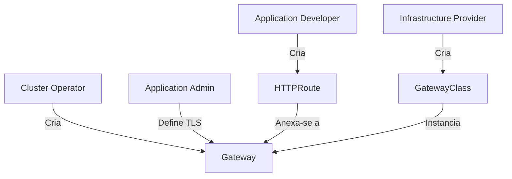
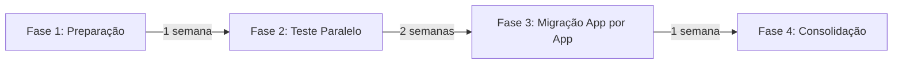
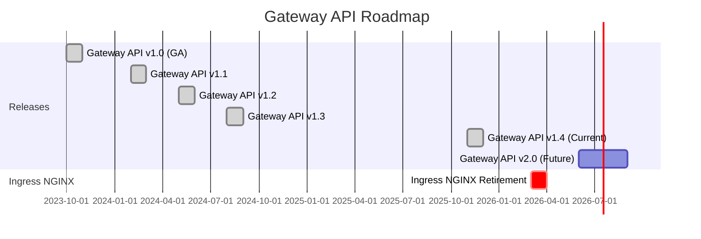

# 🚀 Gateway API Migration Guide - Projeto brioit_local

## 📋 Índice

1. [Visão Geral](#visão-geral)
2. [Gateway API: O Futuro do Roteamento no Kubernetes](#gateway-api-o-futuro)
3. [Comparação: Ingress vs Gateway API](#comparação-ingress-vs-gateway-api)
4. [Impacto no Projeto Atual](#impacto-no-projeto-atual)
5. [Exemplo de Migração](#exemplo-de-migração)
6. [Facilidade de Ajuste](#facilidade-de-ajuste)
7. [Quando Migrar](#quando-migrar)
8. [Referências](#referências)

---

## 🎯 Visão Geral

### **Resposta Direta às Perguntas:**

| Pergunta                           | Resposta                                                                                                                          |
| ---------------------------------- | --------------------------------------------------------------------------------------------------------------------------------- |
| **Gateway API será o padrão?**     | ✅ **SIM** - Gateway API v1.4 (Nov 2025) é o sucessor oficial do Ingress API. Kubernetes SIG Network recomenda migração.          |
| **O que mudaria hoje no projeto?** | 📦 **1 Gateway + 5 HTTPRoutes** (substituir 5 Ingress atuais) + **instalação de CRDs**                                            |
| **Quais impactos?**                | ⚠️ **MÉDIO** - Mudança arquitetural (conceito de Personas), requer planejamento, mas **SEM downtime necessário**                  |
| **Seria fácil ajustar?**           | ✅ **SIM** - Traefik suporta nativamente Gateway API. Conversão é **1:1 estrutural**, mas requer entendimento dos novos conceitos |

---

## 🌐 Gateway API: O Futuro do Roteamento no Kubernetes

### **Status Oficial (Novembro 2025)**

```yaml
Gateway API v1.4 (Stable)
├── HTTPRoute: GA (Stable)
├── Gateway: GA (Stable)
├── GatewayClass: GA (Stable)
├── GRPCRoute: GA (Stable)
└── ReferenceGrant: GA (Stable)
```

### **Por Que Gateway API é o Futuro?**

#### **1. Limitações do Ingress API Resolvidas**

| Limitação do Ingress                      | Solução no Gateway API                               |
| ----------------------------------------- | ---------------------------------------------------- |
| ❌ Apenas HTTP/HTTPS (limitado)           | ✅ Suporta TCP, UDP, gRPC, HTTP, HTTPS, WebSocket    |
| ❌ Extensões via anotações (não portável) | ✅ Recursos estruturados e portáveis (sem anotações) |
| ❌ Modelo de permissões insuficiente      | ✅ Separação de responsabilidades (4 personas)       |
| ❌ TLS redirect via anotação              | ✅ HTTPRoute nativo com `RequestRedirect` filter     |
| ❌ Sem versionamento de API robusto       | ✅ API madura com versionamento semântico            |
| ❌ Conflitos de rotas não especificados   | ✅ Resolução de conflitos especificada na API        |

#### **2. Modelo de Personas (Separação de Responsabilidades)**



| Persona                     | Responsabilidade                          | Recurso Gerenciado       |
| --------------------------- | ----------------------------------------- | ------------------------ |
| **Infrastructure Provider** | Provedor de infraestrutura (Traefik Labs) | `GatewayClass`           |
| **Cluster Operator**        | Administrador do cluster K8s              | `Gateway` (entry points) |
| **Application Admin**       | Define TLS, políticas de segurança        | `Gateway` (TLS config)   |
| **Application Developer**   | Cria regras de roteamento                 | `HTTPRoute`, `GRPCRoute` |

**🔑 Diferença Chave:** No Ingress API, 1 persona (você) faz tudo. No Gateway API, responsabilidades são explicitamente separadas (mas você ainda pode fazer tudo se quiser).

#### **3. Recursos Nativos vs Anotações**

**Exemplo: TLS Redirect**

**Ingress API (Annotation-based):**

```yaml
apiVersion: networking.k8s.io/v1
kind: Ingress
metadata:
  annotations:
    traefik.ingress.kubernetes.io/redirect-entry-point: https # ❌ Específico do Traefik
```

**Gateway API (Native):**

```yaml
apiVersion: gateway.networking.k8s.io/v1
kind: HTTPRoute
spec:
  rules:
    - filters:
        - type: RequestRedirect # ✅ Portável entre controllers
          requestRedirect:
            scheme: https
            port: 443
```

---

## ⚖️ Comparação: Ingress vs Gateway API

### **Arquitetura Conceitual**

#### **Ingress API (Modelo Atual)**

```
┌─────────────────────────────────────────────────┐
│  IngressClass: traefik (implícito)             │
└─────────────────────────────────────────────────┘
                     ▼
┌─────────────────────────────────────────────────┐
│  Ingress (n8n-ingress)                          │
│  ├── TLS: n8n.local.127.0.0.1.nip.io           │
│  ├── Rule: n8n.local.127.0.0.1.nip.io -> n8n   │
│  └── Backend: Service n8n:5678                  │
└─────────────────────────────────────────────────┘
```

**Características:**

- ✅ Simples (1 recurso por aplicação)
- ❌ Entry points implícitos (HTTP:80, HTTPS:443)
- ❌ TLS configurado por aplicação (redundância)
- ❌ Sem separação de responsabilidades

#### **Gateway API (Modelo Futuro)**

```
┌─────────────────────────────────────────────────┐
│  GatewayClass: traefik                          │
│  (Provedor: Traefik Labs)                       │
└─────────────────────────────────────────────────┘
                     ▼
┌─────────────────────────────────────────────────┐
│  Gateway: production-gateway                     │
│  ├── Listener HTTP:80  (*.local.127.0.0.1...)  │
│  ├── Listener HTTPS:443 (*.local.127.0.0.1...) │
│  │   └── TLS: wildcard-tls-secret              │  ◄─── TLS centralizado
│  └── Managed by: Cluster Operator               │
└─────────────────────────────────────────────────┘
                     ▼
        ┌────────────┬────────────┬────────────┐
        ▼            ▼            ▼            ▼
   HTTPRoute    HTTPRoute    HTTPRoute    HTTPRoute
   (n8n)        (grafana)    (prometheus) (glpi)
```

**Características:**

- ✅ Entry points explícitos (1 Gateway centralizado)
- ✅ TLS centralizado (1 certificado wildcard, menos recursos)
- ✅ Separação de responsabilidades (Gateway vs HTTPRoute)
- ✅ Reutilização de infraestrutura (múltiplas apps → 1 Gateway)
- ⚠️ Mais complexo (2 tipos de recursos: Gateway + HTTPRoute)

### **Comparação Lado a Lado**

| Aspecto                          | Ingress API             | Gateway API                     |
| -------------------------------- | ----------------------- | ------------------------------- |
| **Recursos por App**             | 1 Ingress               | 1 HTTPRoute                     |
| **Infraestrutura Compartilhada** | Implícita               | Explícita (1 Gateway)           |
| **TLS**                          | Por Ingress (5 Secrets) | Por Gateway (1 Wildcard Secret) |
| **Redirect HTTP→HTTPS**          | Anotação                | Filter nativo                   |
| **Portabilidade**                | Baixa (anotações)       | Alta (API estruturada)          |
| **Curva de Aprendizado**         | Baixa                   | Média                           |
| **Maturidade**                   | GA desde 2019           | GA desde 2023 (v1.0)            |
| **Suporte Traefik**              | ✅ Nativo               | ✅ Nativo (v2.10+)              |

---

## 🔍 Impacto no Projeto Atual

### **Mudanças Necessárias para Executar Localmente**

#### **1. Instalação de CRDs (Custom Resource Definitions)**

**ANTES (Ingress API):**

- Nenhum CRD adicional necessário (Ingress é recurso nativo do Kubernetes)

**DEPOIS (Gateway API):**

```bash
# Instalar CRDs do Gateway API v1.4
kubectl apply -f https://github.com/kubernetes-sigs/gateway-api/releases/download/v1.4.0/standard-install.yaml

# CRDs instalados:
# - gateways.gateway.networking.k8s.io
# - gatewayclasses.gateway.networking.k8s.io
# - httproutes.gateway.networking.k8s.io
# - grpcroutes.gateway.networking.k8s.io
# - referencegrants.gateway.networking.k8s.io
```

**⚠️ Impacto:** Adicionar comando ao `start-all.sh` (antes de aplicar manifests).

#### **2. Estrutura de Arquivos**

**ANTES (Estrutura Atual):**

```
k8s/apps/
├── n8n/
│   ├── n8n-deployment.yaml
│   ├── n8n-service.yaml
│   ├── n8n-ingress.yaml          ◄─── 1 arquivo
│   └── n8n-secret-db.yaml
├── grafana/
│   ├── grafana-deployment.yaml
│   ├── grafana-service.yaml
│   ├── grafana-ingress.yaml      ◄─── 1 arquivo
│   └── grafana-secret-db.yaml
└── ...
```

**DEPOIS (Gateway API):**

```
k8s/
├── gateway/                       ◄─── NOVA pasta
│   ├── gateway-class.yaml         ◄─── Novo (provisionado pelo Traefik)
│   ├── production-gateway.yaml    ◄─── Novo (1 Gateway para todas as apps)
│   └── wildcard-tls-secret.yaml   ◄─── Opcional (TLS centralizado)
├── apps/
    ├── n8n/
    │   ├── n8n-deployment.yaml
    │   ├── n8n-service.yaml
    │   ├── n8n-httproute.yaml     ◄─── Substitui n8n-ingress.yaml
    │   └── n8n-secret-db.yaml
    ├── grafana/
    │   ├── grafana-deployment.yaml
    │   ├── grafana-service.yaml
    │   ├── grafana-httproute.yaml ◄─── Substitui grafana-ingress.yaml
    │   └── grafana-secret-db.yaml
    └── ...
```

**📊 Resumo de Impacto nos Arquivos:**

| Ação           | Quantidade       | Descrição                                                    |
| -------------- | ---------------- | ------------------------------------------------------------ |
| **Criar**      | 2 arquivos       | `gateway-class.yaml` + `production-gateway.yaml`             |
| **Substituir** | 5 arquivos       | Ingress → HTTPRoute (n8n, grafana, prometheus, glpi, zabbix) |
| **Opcional**   | 1 arquivo        | `wildcard-tls-secret.yaml` (consolidar TLS)                  |
| **Total**      | **7-8 arquivos** | **5 modificados + 2-3 novos**                                |

#### **3. Mudanças no Traefik (Controller)**

**Boa Notícia:** Traefik suporta **AMBOS** Ingress e Gateway API simultaneamente!

```bash
# Verificar suporte do Traefik
kubectl get pod -n kube-system -l app.kubernetes.io/name=traefik -o yaml | grep -A5 args
```

**Traefik v2.10+ (incluído no k3s v1.34.1):**

- ✅ Suporta Ingress API (atual)
- ✅ Suporta Gateway API v1.4
- ✅ Pode executar ambos simultaneamente (migração gradual possível)

**⚠️ Impacto:** **ZERO** - Nenhuma mudança no Traefik necessária. Controller já suporta Gateway API.

#### **4. Configuração do k3d**

**ANTES (`infra/k3d/k3d-config.yaml`):**

```yaml
apiVersion: k3d.io/v1alpha5
kind: Simple
metadata:
  name: k3d-cluster
image: rancher/k3s:v1.34.1-k3s1 # ◄─── Já suporta Gateway API
servers: 1
agents: 2
ports:
  - port: 8080:80 # HTTP
  - port: 8443:443 # HTTPS
  - port: 30432:30432
```

**DEPOIS:**

```yaml
# NENHUMA MUDANÇA NECESSÁRIA! ✅
# k3s v1.34.1 já inclui Traefik v2.11+ com suporte a Gateway API
```

**⚠️ Impacto:** **ZERO** - Configuração do k3d permanece idêntica.

#### **5. Scripts de Deploy**

**Mudanças em `start-all.sh`:**

```diff
#!/bin/bash

# ... (código existente)

# INFRA - Cert Manager
echo "🔒 Deploying cert-manager..."
kubectl apply -f infra/cert-manager/cert-manager.yaml
sleep 10

+ # Gateway API - Install CRDs
+ echo "🌐 Installing Gateway API CRDs..."
+ kubectl apply -f https://github.com/kubernetes-sigs/gateway-api/releases/download/v1.4.0/standard-install.yaml
+ sleep 5
+
+ # Gateway API - Production Gateway
+ echo "🚪 Creating Production Gateway..."
+ kubectl apply -f k8s/gateway/production-gateway.yaml
+ sleep 10

# APPS - n8n
echo "🔧 Deploying n8n..."
- kubectl apply -f k8s/apps/n8n/n8n-ingress.yaml
+ kubectl apply -f k8s/apps/n8n/n8n-httproute.yaml

# APPS - Grafana
echo "📊 Deploying Grafana..."
- kubectl apply -f k8s/apps/grafana/grafana-ingress.yaml
+ kubectl apply -f k8s/apps/grafana/grafana-httproute.yaml

# ... (continuar para prometheus, glpi, zabbix)
```

**⚠️ Impacto:** Modificação de ~15 linhas no `start-all.sh`.

---

## 📝 Exemplo de Migração

### **Migração do n8n (Passo a Passo)**

#### **ANTES: n8n-ingress.yaml (Atual)**

```yaml
apiVersion: networking.k8s.io/v1
kind: Ingress
metadata:
  name: n8n
  namespace: n8n
spec:
  ingressClassName: traefik
  tls:
    - hosts:
        - n8n.local.127.0.0.1.nip.io
      secretName: n8n-tls
  rules:
    - host: n8n.local.127.0.0.1.nip.io
      http:
        paths:
          - path: /
            pathType: Prefix
            backend:
              service:
                name: n8n
                port:
                  number: 5678
```

**📊 Análise:**

- 31 linhas
- TLS por aplicação (n8n-tls Secret)
- IngressClass implicitamente ligado ao Traefik
- Roteamento direto (host + path → service)

---

#### **DEPOIS: Estrutura Gateway API**

**1️⃣ production-gateway.yaml (Criado 1x, compartilhado por todas as apps)**

```yaml
apiVersion: gateway.networking.k8s.io/v1
kind: Gateway
metadata:
  name: production-gateway
  namespace: gateway-system # Namespace centralizado
spec:
  gatewayClassName: traefik
  listeners:
    # Listener HTTP (porta 80)
    - name: http
      protocol: HTTP
      port: 80
      hostname: "*.local.127.0.0.1.nip.io"
      allowedRoutes:
        namespaces:
          from: All # Permite HTTPRoutes de todos os namespaces

    # Listener HTTPS (porta 443)
    - name: https
      protocol: HTTPS
      port: 443
      hostname: "*.local.127.0.0.1.nip.io"
      tls:
        mode: Terminate
        certificateRefs:
          - kind: Secret
            name: wildcard-local-tls # Certificado wildcard (*.local.127.0.0.1.nip.io)
            namespace: cert-manager # Gerenciado pelo cert-manager
      allowedRoutes:
        namespaces:
          from: All
```

**📊 Características:**

- **1 Gateway para TODAS as aplicações** (n8n, grafana, prometheus, glpi, zabbix)
- **Entry points explícitos:** HTTP:80 e HTTPS:443
- **TLS centralizado:** 1 certificado wildcard para todos os subdomínios
- **Namespace dedicado:** `gateway-system` (separação de responsabilidades)
- **Wildcard hostname:** `*.local.127.0.0.1.nip.io` (aceita n8n.local, grafana.local, etc.)

---

**2️⃣ n8n-httproute.yaml (Substitui n8n-ingress.yaml)**

```yaml
apiVersion: gateway.networking.k8s.io/v1
kind: HTTPRoute
metadata:
  name: n8n
  namespace: n8n
spec:
  # Anexar ao Gateway de produção
  parentRefs:
    - name: production-gateway
      namespace: gateway-system
      sectionName: https # Listener HTTPS (porta 443)

  # Hostname específico do n8n
  hostnames:
    - "n8n.local.127.0.0.1.nip.io"

  # Regras de roteamento
  rules:
    - matches:
        - path:
            type: PathPrefix
            value: /
      backendRefs:
        - name: n8n
          port: 5678
```

**📊 Análise:**

- **26 linhas** (5 linhas a menos que o Ingress)
- **Sem TLS explícito** (herdado do Gateway)
- **Anexo explícito** ao Gateway via `parentRefs`
- **Roteamento mais claro** (matches + backendRefs)

---

**3️⃣ n8n-http-redirect.yaml (NOVO - Redirect HTTP → HTTPS)**

```yaml
apiVersion: gateway.networking.k8s.io/v1
kind: HTTPRoute
metadata:
  name: n8n-http-redirect
  namespace: n8n
spec:
  # Anexar ao Listener HTTP (porta 80)
  parentRefs:
    - name: production-gateway
      namespace: gateway-system
      sectionName: http # ◄─── Listener HTTP

  hostnames:
    - "n8n.local.127.0.0.1.nip.io"

  # Regra de redirect
  rules:
    - filters:
        - type: RequestRedirect
          requestRedirect:
            scheme: https
            port: 443
            statusCode: 301 # Permanent redirect
```

**📊 Análise:**

- **Redirect nativo** (não é anotação!)
- **Portável** (funciona em qualquer controller Gateway API)
- **Anexado ao listener HTTP** (porta 80)
- **Status code configurável** (301 ou 302)

---

#### **Comparação de Complexidade**

| Aspecto                     | Ingress API            | Gateway API                                         |
| --------------------------- | ---------------------- | --------------------------------------------------- |
| **Arquivos por App**        | 1 (`n8n-ingress.yaml`) | 2 (`n8n-httproute.yaml` + `n8n-http-redirect.yaml`) |
| **Arquivos Compartilhados** | 0                      | 1 (`production-gateway.yaml` - todas as apps)       |
| **Total de Linhas (n8n)**   | 31 linhas              | 26 + 22 = 48 linhas                                 |
| **TLS Secrets**             | 1 por app (5 total)    | 1 wildcard (1 total)                                |
| **Redirect HTTP→HTTPS**     | Anotação Traefik       | HTTPRoute nativo                                    |
| **Portabilidade**           | Baixa                  | Alta                                                |

**🔑 Insight:** Gateway API tem **mais arquivos** (2 vs 1 por app), mas **menos linhas totais** quando consideramos o Gateway compartilhado e TLS centralizado.

---

### **Cálculo de Impacto Total (5 Aplicações)**

#### **Arquivos Necessários**

| Tipo de Arquivo          | Ingress API (Atual) | Gateway API (Futuro)          |
| ------------------------ | ------------------- | ----------------------------- |
| **Gateway**              | 0                   | 1 (`production-gateway.yaml`) |
| **HTTPRoute (HTTPS)**    | -                   | 5 (1 por app)                 |
| **HTTPRoute (Redirect)** | -                   | 5 (1 por app)                 |
| **Ingress**              | 5                   | 0 (removidos)                 |
| **TLS Secrets**          | 5 (individuais)     | 1 (wildcard)                  |
| **TOTAL**                | **10 arquivos**     | **12 arquivos** (+2)          |

**📊 Análise:**

- **+2 arquivos totais** (Gateway + HTTPRoute adicional por redirect)
- **-4 TLS Secrets** (5 individuais → 1 wildcard)
- **+10 HTTPRoutes** (5 HTTPS + 5 HTTP redirect)
- **-5 Ingress** (removidos)

**🎯 Resumo:** Migração adiciona **~12 arquivos** (Gateway API) e remove **5 arquivos** (Ingress), mas consolida TLS (5→1 Secret).

---

## 🛠️ Facilidade de Ajuste

### **Avaliação de Dificuldade**

| Aspecto          | Dificuldade | Justificativa                                                                                     |
| ---------------- | ----------- | ------------------------------------------------------------------------------------------------- |
| **Conceitual**   | 🟡 Média    | Requer entender modelo de Personas (Gateway vs HTTPRoute)                                         |
| **Técnica**      | 🟢 Fácil    | Conversão 1:1 (Ingress → HTTPRoute), estrutura similar                                            |
| **Traefik**      | 🟢 Fácil    | Suporte nativo, nenhuma mudança no controller                                                     |
| **Testes**       | 🟢 Fácil    | URLs permanecem as mesmas (`n8n.local...`, `grafana.local...`)                                    |
| **Rollback**     | 🟢 Fácil    | Pode manter ambos (Ingress + Gateway API) simultaneamente                                         |
| **Documentação** | 🟢 Fácil    | Gateway API v1.4 tem docs excelentes ([gateway-api.sigs.k8s.io](https://gateway-api.sigs.k8s.io)) |

**🎯 Conclusão:** Ajuste é **tecnicamente fácil**, mas requer **planejamento** (entender modelo de Personas).

---

### **Estratégia de Migração Gradual (Recomendada)**



#### **Fase 1: Preparação (1 semana)**

```bash
# 1. Instalar CRDs do Gateway API
kubectl apply -f https://github.com/kubernetes-sigs/gateway-api/releases/download/v1.4.0/standard-install.yaml

# 2. Criar GatewayClass (provisionado pelo Traefik automaticamente)
# Verificar:
kubectl get gatewayclass

# 3. Criar Gateway de produção
kubectl apply -f k8s/gateway/production-gateway.yaml

# 4. Criar certificado wildcard (cert-manager)
cat <<EOF | kubectl apply -f -
apiVersion: cert-manager.io/v1
kind: Certificate
metadata:
  name: wildcard-local-tls
  namespace: cert-manager
spec:
  secretName: wildcard-local-tls
  issuerRef:
    name: letsencrypt-dns01
    kind: ClusterIssuer
  dnsNames:
  - "*.local.127.0.0.1.nip.io"
EOF

# 5. Validar Gateway criado
kubectl get gateway -n gateway-system
kubectl describe gateway production-gateway -n gateway-system
```

#### **Fase 2: Teste Paralelo (2 semanas)**

```bash
# Criar HTTPRoute para 1 aplicação (ex: n8n) SEM remover Ingress
kubectl apply -f k8s/apps/n8n/n8n-httproute.yaml

# Testar ambos os caminhos:
# 1. Via Ingress (existente): https://n8n.local.127.0.0.1.nip.io:8443
# 2. Via HTTPRoute (novo):    https://n8n.local.127.0.0.1.nip.io:8443

# Comparar latências:
curl -o /dev/null -s -w 'Time: %{time_total}s\n' https://n8n.local.127.0.0.1.nip.io:8443

# Validar funcionamento por 2 semanas (monitorar logs, métricas)
```

#### **Fase 3: Migração App por App (1 semana)**

```bash
# Migrar aplicações 1 por vez (minimiza risco):

# Dia 1: n8n
kubectl apply -f k8s/apps/n8n/n8n-httproute.yaml
kubectl delete ingress n8n -n n8n  # ◄─── Remover após validação

# Dia 2: Grafana
kubectl apply -f k8s/apps/grafana/grafana-httproute.yaml
kubectl delete ingress grafana -n grafana

# Dia 3: Prometheus
# Dia 4: GLPI
# Dia 5: Zabbix

# Validar cada app após migração (endpoints, TLS, métricas)
```

#### **Fase 4: Consolidação (1 semana)**

```bash
# 1. Remover Secrets TLS individuais (agora usando wildcard)
kubectl delete secret n8n-tls -n n8n
kubectl delete secret grafana-tls -n grafana
# ... (outros)

# 2. Atualizar documentação
vim README-MAIN.md  # Adicionar seção Gateway API

# 3. Atualizar start-all.sh (usar HTTPRoutes)

# 4. Criar análise pós-migração
# - Comparar latências (antes/depois)
# - Comparar uso de recursos (kubectl top)
# - Validar logs (kubectl logs)
```

**⏱️ Timeline Total:** **4-5 semanas** (incluindo monitoramento)

---

### **Ferramenta de Conversão Automática**

**ingress2gateway:** Converte Ingress → Gateway API automaticamente.

```bash
# Instalar ingress2gateway
go install github.com/kubernetes-sigs/ingress2gateway@latest

# Converter Ingress → HTTPRoute
ingress2gateway print \
  --input-file=k8s/apps/n8n/n8n-ingress.yaml \
  --output-file=k8s/apps/n8n/n8n-httproute.yaml \
  --providers=traefik

# Revisar arquivo gerado (sempre validar manualmente!)
cat k8s/apps/n8n/n8n-httproute.yaml
```

**⚠️ Limitações:**

- ✅ Converte estrutura básica (host, path, backend)
- ⚠️ Anotações Traefik precisam ser convertidas manualmente
- ❌ Não cria Gateway automaticamente (apenas HTTPRoute)
- ✅ Útil como ponto de partida, mas requer revisão

---

### **Checklist de Migração**

```markdown
## Preparação

- [ ] Estudar Gateway API v1.4 docs (2-3 horas)
- [ ] Instalar CRDs do Gateway API no cluster
- [ ] Criar namespace `gateway-system`
- [ ] Criar GatewayClass (verificar auto-provisioning do Traefik)
- [ ] Criar Gateway de produção (`production-gateway.yaml`)
- [ ] Criar certificado wildcard via cert-manager

## Teste (App Piloto: n8n)

- [ ] Criar `n8n-httproute.yaml` (manter `n8n-ingress.yaml` ativo)
- [ ] Aplicar HTTPRoute: `kubectl apply -f k8s/apps/n8n/n8n-httproute.yaml`
- [ ] Testar endpoint: `curl https://n8n.local.127.0.0.1.nip.io:8443`
- [ ] Validar TLS: `openssl s_client -connect n8n.local.127.0.0.1.nip.io:8443`
- [ ] Comparar latências (Ingress vs HTTPRoute)
- [ ] Monitorar logs por 2 semanas
- [ ] Validar métricas (Prometheus + Grafana)

## Migração Completa

- [ ] Migrar Grafana (Dia 2)
- [ ] Migrar Prometheus (Dia 3)
- [ ] Migrar GLPI (Dia 4)
- [ ] Migrar Zabbix (Dia 5)
- [ ] Remover Ingress resources (após validação de cada app)
- [ ] Remover TLS Secrets individuais
- [ ] Atualizar `start-all.sh`
- [ ] Atualizar `README-MAIN.md`

## Pós-Migração

- [ ] Documentar processo (learnings, problemas encontrados)
- [ ] Criar runbook para troubleshooting
- [ ] Treinar equipe (se houver)
- [ ] Monitorar por 1 mês (métricas, logs, alertas)
```

---

## ⏰ Quando Migrar

### **Recomendação: NÃO URGENTE, mas PLANEJADO**

| Cenário                             | Recomendação                            | Prioridade |
| ----------------------------------- | --------------------------------------- | ---------- |
| **Projeto usa Traefik**             | ✅ Migrar quando conveniente            | 🟡 Média   |
| **Projeto usa ingress-nginx**       | ❌ Migrar ANTES de março/2026           | 🔴 Alta    |
| **Projeto pequeno (<5 apps)**       | ⏸️ Aguardar Gateway API v2.0 (2026)     | 🟢 Baixa   |
| **Projeto grande (>10 apps)**       | ✅ Migrar em 2025 (aproveitar features) | 🟡 Média   |
| **Multi-tenancy (múltiplos times)** | ✅ Migrar AGORA (modelo de Personas)    | 🔴 Alta    |

**🎯 Para brioit_local:**

- **Status Atual:** Traefik (não afetado por ingress-nginx retirement)
- **Número de Apps:** 5 (pequeno)
- **Multi-tenancy:** Não (você é o único operador)
- **Recomendação:** ⏸️ **Aguardar** Gateway API v2.0 (2026) **OU** migrar quando precisar de features avançadas (ex: gRPC, traffic splitting)

---

### **Gatilhos para Migração (Quando Faz Sentido)**

✅ **Migrar SE:**

1. **Precisar de gRPC routing** (ex: microservices modernos)
2. **Traffic splitting** para A/B testing (ex: n8n v1.119.1 vs v1.120.1)
3. **Request mirroring** para testes de carga
4. **Header-based routing** (ex: rotear por `X-User-Type: admin`)
5. **Projeto crescer para >10 aplicações** (Gateway API escala melhor)
6. **Múltiplos times** compartilhando infraestrutura (Personas)
7. **Portabilidade** (ex: mover de Traefik para Istio no futuro)

❌ **NÃO Migrar SE:**

1. Projeto pequeno e estável (5 apps, sem crescimento planejado)
2. Ingress API atende todas as necessidades (HTTP/HTTPS simples)
3. Não há tempo para entender novos conceitos (Personas, Gateway, etc.)
4. Preferir simplicidade sobre features avançadas

**🎯 Para brioit_local:** Ingress API ainda é **suficiente** para seu caso de uso atual (HTTP/HTTPS simples, 5 apps, 1 operador).

---

### **Timeline Kubernetes Gateway API**



**🔑 Marcos Importantes:**

- ✅ **Nov 2025:** Gateway API v1.4 (CURRENT - Stable)
- 🚨 **Março 2026:** Ingress NGINX retirement (sem suporte após essa data)
- 🔮 **Jun-Set 2026:** Gateway API v2.0 (estimado) - Breaking changes esperados

**🎯 Janela Ideal para Migração (brioit_local):**

- **Opção 1 (Conservadora):** Aguardar Gateway API v2.0 (Set 2026) e migrar em versão estável
- **Opção 2 (Inovadora):** Migrar agora em Gateway API v1.4 (Stable) e ganhar experiência

---

## 📚 Referências

### **Documentação Oficial**

| Recurso                                 | URL                                                                  |
| --------------------------------------- | -------------------------------------------------------------------- |
| **Gateway API Official Site**           | https://gateway-api.sigs.k8s.io/                                     |
| **Migration Guide (Ingress → Gateway)** | https://gateway-api.sigs.k8s.io/guides/migrating-from-ingress/       |
| **HTTPRoute Specification**             | https://gateway-api.sigs.k8s.io/api-types/httproute/                 |
| **Gateway Specification**               | https://gateway-api.sigs.k8s.io/api-types/gateway/                   |
| **Traefik Gateway API Support**         | https://doc.traefik.io/traefik/routing/providers/kubernetes-gateway/ |

### **Ferramentas**

| Ferramenta                      | Descrição                                  | URL                                                                |
| ------------------------------- | ------------------------------------------ | ------------------------------------------------------------------ |
| **ingress2gateway**             | Conversor automático Ingress → Gateway API | https://github.com/kubernetes-sigs/ingress2gateway                 |
| **gwctl**                       | CLI para inspecionar Gateway API resources | https://gateway-api.sigs.k8s.io/concepts/tooling/#gwctl            |
| **Kubernetes Gateway API CRDs** | CRDs oficiais (v1.4)                       | https://github.com/kubernetes-sigs/gateway-api/releases/tag/v1.4.0 |

### **Artigos e Tutoriais**

1. **"Gateway API is GA!"** (Kubernetes Blog, Oct 2023)

   - https://kubernetes.io/blog/2023/10/31/gateway-api-ga/

2. **"Traefik + Gateway API Tutorial"** (Traefik Labs)

   - https://doc.traefik.io/traefik/routing/providers/kubernetes-gateway/

3. **"Gateway API vs Ingress API"** (CNCF Blog)

   - Comparação detalhada de features e limitações

4. **"Ingress NGINX Retirement Announcement"** (Kubernetes Blog, Nov 2025)
   - https://kubernetes.io/blog/2025/11/11/ingress-nginx-retirement/

### **Comparação de Controllers**

| Controller               | Ingress API     | Gateway API v1.4 | Notas                                  |
| ------------------------ | --------------- | ---------------- | -------------------------------------- |
| **Traefik**              | ✅              | ✅               | Suporte completo desde v2.10           |
| **NGINX Gateway Fabric** | ❌              | ✅               | Substituto oficial do Ingress NGINX    |
| **Istio**                | ⚠️ (deprecated) | ✅               | Migração para Gateway API em andamento |
| **Contour**              | ✅              | ✅               | Suporte dual                           |
| **HAProxy**              | ✅              | ✅               | Suporte experimental                   |
| **Kong**                 | ✅              | ✅               | Gateway API nativo                     |

---

## 🎯 Conclusão

### **Resposta Final às Perguntas**

1. **Gateway API será o padrão?**

   - ✅ **SIM** - Gateway API v1.4 (Nov 2025) é o sucessor oficial do Ingress API
   - Kubernetes SIG Network recomenda migração
   - Ingress API permanece suportado, mas novas features vão para Gateway API

2. **O que mudaria hoje no projeto para executar localmente?**

   - **7-8 arquivos:** 1 Gateway + 5 HTTPRoutes (HTTPS) + 5 HTTPRoutes (Redirect) + 1 TLS Secret wildcard
   - **Instalar CRDs:** Gateway API v1.4 (comando único)
   - **Atualizar start-all.sh:** ~15 linhas modificadas
   - **Traefik:** ZERO mudanças (já suporta Gateway API)

3. **Quais impactos?**

   - **Conceitual:** 🟡 Médio (entender Personas, Gateway vs HTTPRoute)
   - **Técnico:** 🟢 Baixo (conversão 1:1, estrutura similar)
   - **Operacional:** 🟢 Baixo (migração gradual possível, sem downtime)
   - **Funcional:** ✅ ZERO (endpoints permanecem os mesmos)

4. **Seria fácil ajustar o código?**
   - ✅ **SIM** - Tecnicamente simples (Traefik suporta nativamente)
   - ⚠️ Requer **planejamento** (4-5 semanas com migração gradual)
   - ✅ **Rollback fácil** (pode manter ambos Ingress + Gateway API)
   - ✅ **Ferramenta automática** disponível (ingress2gateway)

### **Recomendação Final (brioit_local)**

```
┌─────────────────────────────────────────────────────────────┐
│  RECOMENDAÇÃO: ⏸️ AGUARDAR Gateway API v2.0 (Set 2026)      │
│                                                             │
│  JUSTIFICATIVA:                                             │
│  ✅ Projeto usa Traefik (não afetado por ingress-nginx)    │
│  ✅ 5 aplicações (Ingress API suficiente)                  │
│  ✅ Sem necessidade de features avançadas (gRPC, etc.)     │
│  ✅ Gateway API v2.0 trará breaking changes (esperar)      │
│                                                             │
│  ALTERNATIVA: Migrar AGORA se quiser:                       │
│  • Ganhar experiência com Gateway API v1.4                 │
│  • Preparar-se para futuras expansões (>10 apps)           │
│  • Explorar features avançadas (traffic splitting, etc.)   │
│                                                             │
│  PRÓXIMO PASSO:                                             │
│  1. Estudar Gateway API docs (2-3 horas)                   │
│  2. Criar POC com 1 aplicação (n8n)                        │
│  3. Decidir após testes práticos                           │
└─────────────────────────────────────────────────────────────┘
```

**🎯 Decisão é SUA:** Gateway API é **fácil de ajustar**, mas **não urgente** para seu caso. Ingress API ainda é **válido e suportado** até pelo menos 2026 (para Traefik, indefinidamente).

---

**📅 Data de Criação:** 13 de Novembro de 2025  
**📝 Versão:** 1.0  
**🔄 Última Atualização:** 13/11/2025  
**👤 Autor:** GitHub Copilot (Claude Sonnet 4.5)
