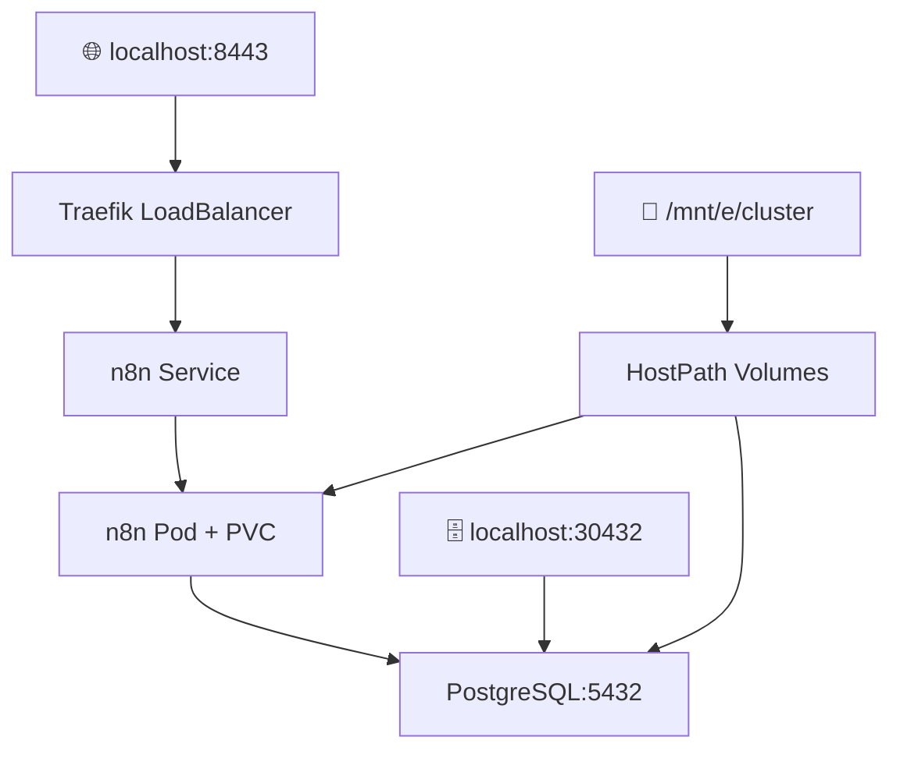

# 🏗️ K8s Local - Ambiente Kubernetes Completo

> 🚀 **Desenvolva Local, Deploy Global**: Ambiente de desenvolvimento Kubernetes completo com k3d, PostgreSQL persistente, n8n automação, Grafana monitoring e sistema de backup profissional. **100% compatível com qualquer cluster Kubernetes de produção**!

[](https://opensource.org/licenses/MIT)
[](https://k3d.io/)
[](https://www.postgresql.org/)
[](https://redis.io/)
[](https://n8n.io/)
[](https://grafana.com/)
[](./backup/README.md)

## 📋 Sumário

- [🎯 Início Rápido](#-início-rápido)
- [📂 Estrutura do Projeto](#-estrutura-do-projeto)
- [🏗️ Arquitetura](#️-arquitetura)
- [🗄️ Sistema de Backup](#️-sistema-de-backup)
- [📚 Documentação](#-documentação)
- [🛠️ Scripts Disponíveis](#️-scripts-disponíveis)
- [🔧 Configuração](#-configuração)
- [🚨 Troubleshooting](#-troubleshooting)
- [🎯 Produção](#-deploy-para-produção)

## 🎯 Início Rápido

### **⚡ Setup Completo em 1 Comando**

```bash
# 🚀 Deploy completo (infraestrutura + 4 aplicações)
./start-all.sh

# OU deploy aplicações específicas:
./start-all.sh n8n                    # Infra + n8n
./start-all.sh grafana                # Infra + grafana
./start-all.sh prometheus             # Infra + prometheus
./start-all.sh glpi                   # Infra + glpi
```

### **⚙️ Configuração de Credenciais (primeira execução)**

```bash
# 1. Copiar templates de configuração (infraestrutura)
cp infra/postgres/postgres-secret-admin.yaml.template \
   infra/postgres/postgres-secret-admin.yaml
cp infra/mariadb/mariadb-secret-admin.yaml.template \
   infra/mariadb/mariadb-secret-admin.yaml
cp infra/redis/redis-secret.yaml.template \
   infra/redis/redis-secret.yaml

# 2. Copiar templates de aplicações
cp k8s/apps/n8n/n8n-secret-db.yaml.template \
   k8s/apps/n8n/n8n-secret-db.yaml
cp k8s/apps/grafana/grafana-secret-db.yaml.template \
   k8s/apps/grafana/grafana-secret-db.yaml
cp k8s/apps/prometheus/prometheus-secret-db.yaml.template \
   k8s/apps/prometheus/prometheus-secret-db.yaml
cp k8s/apps/glpi/glpi-secret-db.yaml.template \
   k8s/apps/glpi/glpi-secret-db.yaml

# 3. Editar e configurar credenciais reais
nano infra/postgres/postgres-secret-admin.yaml     # PostgreSQL admin
nano infra/mariadb/mariadb-secret-admin.yaml       # MariaDB admin
nano infra/redis/redis-secret.yaml                 # Redis password
nano k8s/apps/n8n/n8n-secret-db.yaml              # n8n (PG + Redis)
nano k8s/apps/grafana/grafana-secret-db.yaml       # Grafana (PG + Redis)
nano k8s/apps/prometheus/prometheus-secret-db.yaml # Prometheus (PG + Redis)
nano k8s/apps/glpi/glpi-secret-db.yaml             # GLPI (MariaDB + Redis)
```

### **🌐 Acesso Rápido**

- **n8n 1.118.2**: https://n8n.local.127.0.0.1.nip.io:8443 (Configure primeiro usuário)
- **Grafana 12.2.1**: https://grafana.local.127.0.0.1.nip.io:8443 (admin/Admin_Grafana_2025_K8s_10243769)
- **Prometheus v3.7.3**: https://prometheus.local.127.0.0.1.nip.io:8443
- **GLPI 11.0.1**: https://glpi.local.127.0.0.1.nip.io:8443
- **PostgreSQL 16**: localhost:30432 (databases: n8n, grafana, prometheus)
- **MariaDB 12.0.2**: localhost:30306 (database: glpi)
- **Redis 8.2.3**: redis.redis.svc.cluster.local:6379 (DB0=n8n, DB1=grafana, DB2=glpi, DB3=prometheus)

---

## 📂 Estrutura do Projeto

```
k8s_local/
├── start-all.sh                # 🚀 Deploy completo (NOVO!)
├── infra/                      # 🏗️ Infraestrutura base
│   ├── scripts/                # Scripts de gerenciamento
│   │   ├── 9.setup-directories.sh    # Preparar estrutura
│   │   ├── 10.start-infra.sh         # Subir infraestrutura
│   │   └── 2.destroy-infra.sh        # Limpeza (mantém dados)
│   ├── k3d/                    # Configuração do cluster
│   ├── postgres/               # PostgreSQL persistente
│   ├── mariadb/                # MariaDB para GLPI
│   ├── redis/                  # Redis cache
│   └── cert-manager/           # Certificados TLS
├── k8s/                        # 🚀 Aplicações Kubernetes
│   └── apps/
│       ├── n8n/                # Automação n8n
│       │   ├── scripts/        # Deploy e manutenção
│       │   │   ├── 1.deploy-n8n.sh        # Deploy aplicação
│       │   │   ├── 2.destroy-n8n.sh       # Remove app (mantém dados)
│       │   │   └── 4.drop-database-n8n.sh # Limpeza COMPLETA
│       │   └── *.yaml         # Manifests K8s
│       ├── grafana/            # Monitoramento Grafana
│       │   ├── scripts/        # Deploy e manutenção
│       │   │   ├── 1.deploy-grafana.sh         # Deploy aplicação
│       │   │   ├── 2.destroy-grafana.sh        # Remove app (mantém dados)
│       │   │   └── 4.drop-database-grafana.sh  # Limpeza COMPLETA
│       │   └── *.yaml         # Manifests K8s
│       ├── prometheus/         # Monitoramento Prometheus
│       │   ├── scripts/        # Deploy e manutenção
│       │   └── *.yaml         # Manifests K8s
│       └── glpi/               # ITSM e Service Desk
│           ├── scripts/        # Deploy e manutenção
│           │   ├── 1.deploy-glpi.sh        # Deploy aplicação
│           │   ├── 2.destroy-glpi.sh       # Remove app (mantém dados)
│           │   └── 4.drop-database-glpi.sh # Limpeza COMPLETA
│           └── *.yaml         # Manifests K8s
├── backup/                     # 🗄️ Sistema de Backup
│   ├── scripts/               # Scripts de backup/restore
│   ├── cronjobs/              # Backup automático
│   └── README.md              # Documentação backup
└── README*.md                 # 📚 Documentação modular
```

### **🎯 Estrutura de Dados Organizada (hostPath)**

```
/home/dsm/cluster/              # 📂 Base organizada (hostPath persistente)
├── postgresql/                 # 🗄️ Dados PostgreSQL
│   ├── data/                  # Dados principais PostgreSQL
│   └── backup/               # Backups de databases
├── redis/                     # 🔴 Dados Redis (NOVO!)
│   └── data/                 # Cache e sessões
├── pvc/                       # 📁 Volumes persistentes das aplicações
│   ├── n8n/                 # Arquivos do n8n
│   ├── grafana/              # Dados Grafana (NOVO!)
│   └── backup/              # Backups de volumes
```

## 🏗️ Arquitetura

### **🔧 Componentes Principais**

| Componente       | Versão   | Função                   | Acesso            |
| ---------------- | -------- | ------------------------ | ----------------- |
| **k3d**          | 5.8.3    | Cluster Kubernetes local | `kubectl`         |
| **PostgreSQL**   | 16       | Database persistente     | `localhost:30432` |
| **Redis**        | 8.2.3    | Cache e sessões          | Interno (cluster) |
| **n8n**          | 1.118.2  | Automação workflows      | HTTPS `:8443`     |
| **Grafana**      | 12.2.1   | Dashboards e monitoring  | HTTPS `:8443`     |
| **Traefik**      | Built-in | Ingress Controller       | HTTP/HTTPS        |
| **cert-manager** | 1.18.2   | Certificados TLS         | Automático        |

### **🌐 Rede e Acesso**



### **💾 Persistência de Dados**

- **PostgreSQL**: `hostPath:/mnt/e/cluster/postgresql`
- **n8n Files**: `hostPath:/mnt/e/cluster/pvc/n8n`
- **Backups DB**: `/mnt/e/cluster/postgresql/backup`
- **Backups PVC**: `/mnt/e/cluster/pvc/backup`

## 🗄️ Sistema de Backup

### **🚀 Backup Rápido**

```bash
# Backup completo do n8n
./backup/scripts/manage-backups.sh create n8n full

# Listar backups
./backup/scripts/manage-backups.sh list n8n

# Restaurar backup
./backup/scripts/manage-backups.sh restore n8n 20240924_143022
```

### **⏰ Backup Automático**

```bash
# Ativar backup diário às 02:00
./backup/scripts/manage-backups.sh schedule n8n

# Verificar status
./backup/scripts/manage-backups.sh status
```

### **📊 Tipos de Backup**

| Tipo    | Conteúdo         | Local                 | Uso               |
| ------- | ---------------- | --------------------- | ----------------- |
| `db`    | PostgreSQL dump  | `/postgresql/backup/` | Dados aplicação   |
| `files` | PVC tar.gz       | `/pvc/backup/`        | Arquivos, configs |
| `full`  | DB + Files + K8s | Ambos                 | Backup completo   |

**📖 [Documentação Completa de Backup](./backup/README.md)**

## 📚 Documentação

### **📋 READMEs Especializados**

| Arquivo                    | Conteúdo                          |
| -------------------------- | --------------------------------- |
| `README.md`                | 📖 **Este arquivo** - Visão geral |
| `README-SECURITY.md`       | 🔐 Configuração de segurança      |
| `README-INFRASTRUCTURE.md` | 🏗️ Detalhes da infraestrutura     |
| `README-DEPLOYMENT.md`     | 🚀 Guia de deployment             |
| `README-DEVELOPMENT.md`    | 👨‍💻 Guia para desenvolvedores      |
| `backup/README.md`         | 🗄️ Sistema de backup completo     |

## 🛠️ Scripts Disponíveis

### **🏗️ Infraestrutura**

```bash
./infra/scripts/9.setup-directories.sh   # Preparar estrutura
./infra/scripts/10.start-infra.sh        # Subir infraestrutura
./infra/scripts/2.destroy-infra.sh       # Destruir tudo
```

### **🚀 Aplicações**

```bash
./k8s/apps/n8n/scripts/1.deploy-n8n.sh  # Deploy n8n
./k8s/apps/n8n/scripts/2.delete-n8n.sh  # Remover n8n
```

### **🗄️ Backup**

```bash
./backup/scripts/manage-backups.sh       # Gerenciador principal
./backup/scripts/backup-app.sh           # Backup manual
./backup/scripts/restore-app.sh          # Restore manual
```

## 🔧 Configuração

### **1. 📋 Pré-requisitos**

- Docker
- k3d v5.8.3+
- kubectl

### **2. 🔐 Credenciais (OBRIGATÓRIO)**

```bash
# Copiar templates
cp infra/postgres/postgres-secret-admin.yaml.template \
   infra/postgres/postgres-secret-admin.yaml

cp k8s/apps/n8n/n8n-secret-db.yaml.template \
   k8s/apps/n8n/n8n-secret-db.yaml

# Editar e definir senhas
# Substituir: YOUR_POSTGRES_ADMIN_PASSWORD_HERE
```

### **3. 🚀 Execução**

```bash
# Setup completo
./infra/scripts/10.start-infra.sh
./k8s/apps/n8n/scripts/1.deploy-n8n.sh

# Verificar status
kubectl get pods -A
```

## 🚨 Troubleshooting

### **❌ Problemas Comuns**

#### **1. Cluster não sobe**

```bash
k3d cluster delete k3d-cluster
./infra/scripts/10.start-infra.sh
```

#### **2. Senha não configurada**

```bash
# Verificar se substituis a senha
grep "YOUR_POSTGRES" infra/postgres/postgres-secret-admin.yaml
```

#### **3. n8n não acessa banco**

```bash
# Verificar conectividade
kubectl exec -n n8n deployment/n8n -- nc -zv postgres.default.svc.cluster.local 5432
```

#### **4. Backup falha**

```bash
# Verificar permissões
ls -la /mnt/e/cluster/
./backup/scripts/manage-backups.sh status
```

### **🔍 Logs Úteis**

```bash
# Logs n8n
kubectl logs -n n8n deployment/n8n -f

# Logs PostgreSQL
kubectl logs -n default statefulset/postgres -f

# Status completo
kubectl get all -A
```

## 🎯 Deploy para Produção

### **☁️ Compatibilidade Cloud**

Este projeto é **100% compatível** com:

- **AKS** (Azure Kubernetes Service)
- **EKS** (Amazon Elastic Kubernetes Service)
- **GKE** (Google Kubernetes Engine)
- **Self-managed** Kubernetes

### **🔄 Path to Production**

```bash
# 1. Mesmo código, cluster diferente
kubectl config use-context production-cluster

# 2. Ajustar apenas storage classes
# local-path → azure-disk (AKS)
# local-path → gp2 (EKS)
# local-path → ssd (GKE)

# 3. Deploy idêntico
kubectl apply -f k8s/apps/n8n/
```

### **📋 Checklist de Produção**

- [ ] Trocar `manual` por storage class da cloud
- [ ] Configurar DNS real (não `.nip.io`)
- [ ] Certificados Let's Encrypt
- [ ] Backup para cloud storage
- [ ] Monitoring e alertas
- [ ] Resource limits adequados

---

## 🤝 Contribuindo

1. Fork o projeto
2. Crie uma branch (`git checkout -b feature/nova-funcionalidade`)
3. Commit suas mudanças (`git commit -am 'Adiciona nova funcionalidade'`)
4. Push para a branch (`git push origin feature/nova-funcionalidade`)
5. Abra um Pull Request

## 📄 Licença

Este projeto está sob a licença MIT. Veja o arquivo [LICENSE](LICENSE) para detalhes.

---

**🎯 Feito para desenvolvedores que querem simplicidade sem perder flexibilidade!**

**⭐ Se este projeto te ajudou, considera dar uma estrela!**
