# n8n - Automação de Workflows

> Documentação específica da aplicação n8n: deployment, configuração, uso e troubleshooting.

## 📋 Sumário

- [Visão Geral n8n](#-visão-geral-n8n)
- [Arquitetura](#-arquitetura)
- [Configuração](#-configuração)
- [Deploy n8n](#-deploy-n8n)
- [Acesso e Uso](#-acesso-e-uso)
- [Scaling e Performance](#-scaling-e-performance)
- [Backup e Restore](#-backup-e-restore)
- [Troubleshooting n8n](#-troubleshooting-n8n)
- [Desenvolvimento n8n](#-desenvolvimento-n8n)

## 🎯 Visão Geral n8n

**n8n** é uma plataforma de automação de workflows que permite conectar diferentes serviços e APIs através de uma interface visual.

### Características do Deploy

- **Versão**: n8n 1.114.4
- **Namespace**: `n8n`
- **Banco de dados**: PostgreSQL (infraestrutura compartilhada)
- **Cache**: Redis 8.2.1 (performance otimizada)
- **Acesso**: HTTPS via Traefik Ingress
- **Scaling**: HPA (Horizontal Pod Autoscaler)
- **Certificados**: TLS via cert-manager

## 🏗 Arquitetura

### Componentes n8n

```
k8s/apps/n8n/
├── n8n-namespace.yaml          # Namespace dedicado
├── n8n-secret-db.yaml          # Credenciais completas (DB + Redis)
├── n8n-secret-db.yaml.template # Template seguro
├── n8n-deployment.yaml         # Deployment n8n 1.114.4
├── n8n-service.yaml           # Service ClusterIP
├── n8n-hpa.yaml               # Auto-scaling (CPU + Memória)
├── n8n-certificate.yaml       # Certificado TLS automático
├── n8n-ingress.yaml           # Ingress HTTPS
├── n8n-pvc.yaml               # Persistent Volume Claims
└── scripts/
    ├── 1.deploy-n8n.sh        # Deploy completo n8n
    └── 3.start-n8n.sh         # Script de inicialização
    ├── 2.destroy-n8n.sh       # Remove n8n + Redis
    ├── 3.start-n8n.sh         # Start/restart com verificação Redis
    └── ...
```

### Fluxo de Dados

```mermaid
graph LR
    User[Usuário] --> Traefik[Traefik:8443]
    Traefik --> |HTTPS| Ingress[n8n-ingress]
    Ingress --> Service[n8n-service:5678]
    Service --> Pod1[n8n-pod-1]
    Service --> Pod2[n8n-pod-2]
    Service --> Pod3[n8n-pod-N]
    Pod1 --> |SQL| PostgreSQL[(PostgreSQL)]
    Pod2 --> |SQL| PostgreSQL
    Pod3 --> |SQL| PostgreSQL
```



## ⚙️ Configuração

### Database Secret

**Template** (`n8n-secret-db.yaml.template`):

```yaml
apiVersion: v1
kind: Secret
metadata:
  name: n8n-db-secret
  namespace: n8n
type: Opaque
stringData:
  DB_POSTGRESDB_HOST: postgres.default.svc.cluster.local
  DB_POSTGRESDB_PORT: "5432"
  DB_POSTGRESDB_DATABASE: n8n
  DB_POSTGRESDB_USER: postgres
  DB_POSTGRESDB_PASSWORD: YOUR_POSTGRES_ADMIN_PASSWORD_HERE
```

### Deployment Configuration

**Principais variáveis de ambiente**:

```yaml
env:
  # Database
  - name: DB_TYPE
    value: postgresdb
  - name: DB_POSTGRESDB_HOST
    valueFrom:
      secretKeyRef:
        name: n8n-db-secret
        key: DB_POSTGRESDB_HOST

  # Network
  - name: N8N_HOST
    value: n8n.local.127.0.0.1.nip.io
  - name: N8N_PROTOCOL
    value: https
  - name: WEBHOOK_URL
    value: https://n8n.local.127.0.0.1.nip.io

  # Proxy (Traefik)
  - name: N8N_PROXY_SET_HEADERS
    value: "true"
  - name: N8N_TRUST_PROXY
    value: "true"
  - name: EXPRESS_TRUST_PROXY
    value: "true"

  # Security
  - name: N8N_SECURE_COOKIE
    value: "true"
  - name: N8N_SESSION_COOKIE_SECURE
    value: "true"

  # Performance
  - name: N8N_RATE_LIMITING_DISABLED
    value: "true"
  - name: N8N_RUNNERS_ENABLED
    value: "true"
  - name: N8N_BLOCK_ENV_ACCESS_IN_NODE
    value: "false"
```

### Resources e Limits

```yaml
resources:
  requests:
    cpu: "200m"
    memory: "512Mi"
  limits:
    cpu: "1000m"
    memory: "1536Mi"
```

**Otimizações de Performance Incluídas:**

- `NODE_OPTIONS`: `--max-old-space-size=1024` (heap size 1GB)
- `N8N_BINARY_DATA_TTL`: `60` (cache otimizado)
- `N8N_METRICS`: `true` (métricas habilitadas)

## 🚀 Deploy n8n

### Scripts de Deploy

```bash
# Deploy completo do n8n
./k8s/scripts/1.deploy-n8n.sh

# Remover n8n
./k8s/scripts/2.destroy-n8n.sh

# Deploy automático (recomendado)
./infra/scripts/9.start-n8n.sh
```

### Deploy Manual

```bash
# 1. Criar namespace
kubectl apply -f k8s/apps/n8n/n8n-namespace.yaml

# 2. Configurar secret de database
cp k8s/apps/n8n/n8n-secret-db.yaml.template \
   k8s/apps/n8n/n8n-secret-db.yaml
# Editar n8n-secret-db.yaml com senha real

# 3. Aplicar secret
kubectl apply -f k8s/apps/n8n/n8n-secret-db.yaml

# 4. Deploy da aplicação
kubectl apply -f k8s/apps/n8n/n8n-deployment.yaml
kubectl apply -f k8s/apps/n8n/n8n-service.yaml
kubectl apply -f k8s/apps/n8n/n8n-hpa.yaml

# 5. Configurar TLS
kubectl apply -f k8s/apps/n8n/n8n-certificate.yaml
kubectl apply -f k8s/apps/n8n/n8n-ingress.yaml
```

### Verificação do Deploy

```bash
# Status geral
kubectl get all -n n8n

# Verificar pods
kubectl get pods -n n8n

# Verificar logs
kubectl logs -f deployment/n8n -n n8n

# Verificar ingress
kubectl get ingress -n n8n

# Verificar certificado
kubectl get certificate -n n8n
```

## 🌐 Acesso e Uso

### URLs de Acesso

- **HTTPS (Recomendado)**: https://n8n.local.127.0.0.1.nip.io:8443
- **Port-forward (Desenvolvimento)**: http://localhost:9090

### 🔧 Configuração de HOSTS

> ⚠️ **IMPORTANTE**: O domínio `n8n.local.127.0.0.1.nip.io` é automaticamente adicionado ao `/etc/hosts` durante o deploy.

**Configuração Manual (se necessário):**

```bash
# Adicionar ao /etc/hosts (Linux/WSL2)
echo "127.0.0.1 n8n.local.127.0.0.1.nip.io" | sudo tee -a /etc/hosts

# Verificar se foi adicionado
grep "n8n.local" /etc/hosts
```

**Para WSL2:**

- O script de deploy já configura automaticamente o `/etc/hosts`
- Acesse via Windows: `https://n8n.local.127.0.0.1.nip.io:8443`
- **Porta 8443**: k3d mapeia `443→8443` para evitar privilégios root

**Remover entrada (se necessário):**

```bash
sudo sed -i "/n8n.local.127.0.0.1.nip.io/d" /etc/hosts
```

### Port Forward (Alternativo)

```bash
# Para desenvolvimento sem ingress
kubectl port-forward svc/n8n 9090:5678 -n n8n

# Acesso via: http://localhost:9090
```

### Primeiro Acesso

1. **Abrir**: https://n8n.local.127.0.0.1.nip.io:8443
2. **Aceitar certificado**: Clique em "Avançado" → "Continuar"
3. **Setup inicial**: Criar usuário admin
4. **Começar**: Interface está pronta para uso

### Configuração Inicial

```bash
# Após primeiro login, configure:
# 1. Settings → General → Instance URL (já configurado)
# 2. Settings → Security → Configure conforme necessário
# 3. Credentials → Adicionar integrações necessárias
```

## 📊 Scaling e Performance

### Horizontal Pod Autoscaler (HPA)

**Configuração** (`n8n-hpa.yaml`):

```yaml
apiVersion: autoscaling/v2
kind: HorizontalPodAutoscaler
metadata:
  name: n8n-hpa
  namespace: n8n
spec:
  scaleTargetRef:
    apiVersion: apps/v1
    kind: Deployment
    name: n8n
  minReplicas: 1
  maxReplicas: 5
  metrics:
    - type: Resource
      resource:
        name: cpu
        target:
          type: Utilization
          averageUtilization: 70
    - type: Resource
      resource:
        name: memory
        target:
          type: Utilization
          averageUtilization: 80
  behavior:
    scaleUp:
      stabilizationWindowSeconds: 60
    scaleDown:
      stabilizationWindowSeconds: 300
```

### Monitoramento de Performance

```bash
# Verificar HPA
kubectl get hpa -n n8n

# Monitorar auto-scaling em tempo real
kubectl get hpa n8n-hpa -n n8n -w

# Verificar métricas de recursos
kubectl top pods -n n8n

# Escalar manualmente (temporário)
kubectl scale deployment/n8n --replicas=3 -n n8n
```

### Otimização

```yaml
# Ajustes para produção no deployment:
env:
  # Worker threads
  - name: N8N_WORKERS
    value: "2"

  # Queue configuration
  - name: QUEUE_BULL_REDIS_HOST
    value: "redis.default.svc.cluster.local"

  # Execution timeout
  - name: EXECUTIONS_TIMEOUT
    value: "3600"

  # Memory optimization
  - name: NODE_OPTIONS
    value: "--max-old-space-size=1024"
```

## 💾 Backup e Restore

### Backup do Database

```bash
# Backup específico do database n8n
kubectl exec statefulset/postgres -- pg_dump -U postgres n8n > n8n-backup-$(date +%Y%m%d).sql

# Backup com compressão
kubectl exec statefulset/postgres -- pg_dump -U postgres n8n | gzip > n8n-backup-$(date +%Y%m%d).sql.gz
```

### Restore do Database

```bash
# Restore do backup
kubectl exec -i statefulset/postgres -- psql -U postgres n8n < n8n-backup.sql

# Restore com descompressão
gunzip -c n8n-backup.sql.gz | kubectl exec -i statefulset/postgres -- psql -U postgres n8n
```

### Backup de Workflows

```bash
# Via API (dentro de um pod n8n)
kubectl exec deployment/n8n -n n8n -- curl -X GET \
  "http://localhost:5678/api/v1/workflows" \
  -H "Authorization: Bearer YOUR_API_KEY" > workflows-backup.json
```

### Restore de Workflows

```bash
# Via n8n CLI (dentro do pod)
kubectl exec -it deployment/n8n -n n8n -- n8n import:workflow --file=/tmp/workflows.json
```

## 🔧 Troubleshooting n8n

### Problemas de Acesso

#### n8n não carrega (404)

```bash
# 1. Verificar se pods estão rodando
kubectl get pods -n n8n

# 2. Verificar service
kubectl get svc -n n8n

# 3. Verificar ingress
kubectl describe ingress n8n -n n8n

# 4. Verificar /etc/hosts
cat /etc/hosts | grep n8n

# 5. Testar port-forward
kubectl port-forward svc/n8n 9090:5678 -n n8n
# Acesso: http://localhost:9090
```

#### Certificado TLS inválido

```bash
# Verificar certificado
kubectl get certificate -n n8n
kubectl describe certificate n8n-tls -n n8n

# Recriar certificado
kubectl delete certificate n8n-tls -n n8n
kubectl apply -f k8s/apps/n8n/n8n-certificate.yaml

# Verificar cert-manager
kubectl get pods -n cert-manager
```

### Problemas de Database

#### Erro de conexão com PostgreSQL

```bash
# 1. Verificar secret
kubectl get secret n8n-db-secret -n n8n -o yaml

# 2. Verificar se PostgreSQL está rodando
kubectl get pods -l app=postgres

# 3. Testar conectividade
kubectl run test-db --image=postgres:16 --rm -it -- \
  psql -h postgres.default.svc.cluster.local -U postgres -d n8n

# 4. Verificar logs do n8n
kubectl logs -f deployment/n8n -n n8n
```

#### Database n8n não existe

```bash
# Conectar ao PostgreSQL e criar database
kubectl exec -it postgres-0 -- psql -U postgres

# No psql:
CREATE DATABASE n8n;
\q

# Ou via comando único:
kubectl exec postgres-0 -- psql -U postgres -c "CREATE DATABASE n8n"
```

### Problemas de Performance

#### n8n lento ou travando

```bash
# Verificar recursos
kubectl top pods -n n8n

# Verificar HPA
kubectl get hpa -n n8n

# Escalar manualmente
kubectl scale deployment/n8n --replicas=3 -n n8n

# Verificar logs de erro
kubectl logs deployment/n8n -n n8n --tail=100
```

#### Workflows não executam

```bash
# Verificar workers
kubectl logs deployment/n8n -n n8n | grep worker

# Verificar queue (se habilitado)
kubectl logs deployment/n8n -n n8n | grep queue

# Restart do deployment
kubectl rollout restart deployment/n8n -n n8n
```

### Problemas de Networking

#### Webhooks não funcionam

```bash
# Verificar configuração de webhook URL
kubectl exec deployment/n8n -n n8n -- env | grep WEBHOOK

# Testar webhook externamente
curl -X POST https://n8n.local.127.0.0.1.nip.io:8443/webhook/test

# Verificar logs de webhook
kubectl logs deployment/n8n -n n8n | grep webhook
```

## 🛠 Desenvolvimento n8n

### Desenvolvimento Local

```bash
# Conectar para desenvolvimento
kubectl port-forward svc/n8n 5678:5678 -n n8n

# Acessar logs em tempo real
kubectl logs -f deployment/n8n -n n8n

# Executar comandos n8n
kubectl exec -it deployment/n8n -n n8n -- n8n --help
```

### Customização

#### Variáveis de Ambiente Personalizadas

```yaml
# Adicionar ao deployment:
env:
  # Custom nodes
  - name: N8N_CUSTOM_EXTENSIONS
    value: "/home/node/.n8n/custom"

  # External hooks
  - name: N8N_EXTERNAL_HOOK_FILES
    value: "/home/node/.n8n/hooks.js"

  # Default locale
  - name: N8N_DEFAULT_LOCALE
    value: "pt-BR"
```

#### Volume para Customizações

```yaml
# Adicionar volume ao deployment:
volumes:
  - name: custom-nodes
    configMap:
      name: n8n-custom-nodes

volumeMounts:
  - name: custom-nodes
    mountPath: /home/node/.n8n/custom
```

### Debugging

```bash
# Modo debug
kubectl set env deployment/n8n -n n8n N8N_LOG_LEVEL=debug

# Verificar configuração
kubectl exec deployment/n8n -n n8n -- n8n config

# Verificar status interno
kubectl exec deployment/n8n -n n8n -- curl localhost:5678/healthz
```

---

**n8n K3D Local** - Automação de Workflows no Kubernetes  
_Última atualização: setembro 2025_
