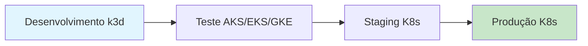

# K3D Local - Ambiente de Desenvolvimento Kubernetes

> 🚀 **Desenvolva Local, Deploy Global**: Ambiente de desenvolvimento local completo usando k3d, PostgreSQL persistente e aplicações automáticas. **100% compatível com qualquer cluster Kubernetes de produção** - AKS, EKS, GKE ou self-managed!

[](https://opensource.org/licenses/MIT)
[](https://k3d.io/)
[](https://www.postgresql.org/)
[](https://n8n.io/)
[](https://cert-manager.io/)

## 🎯 **Status Atual - Infraestrutura Completa**

- ✅ **k3d Cluster**: 1 server + 2 agents + LoadBalancer
- ✅ **PostgreSQL 16**: Persistente com backup/restore
- ✅ **n8n 1.112.5**: HTTPS via cert-manager + TLS automático
- ✅ **cert-manager v1.18.2**: Certificados auto-renováveis (atualizado!)
- ✅ **Sistema de Backup**: PostgreSQL + PVCs completo
- ✅ **Namespaces Organizados**: Separação adequada de recursos

## 🌐 **Pontos de Acesso**

| Serviço        | URL                                       | Porta | Tipo      |
| -------------- | ----------------------------------------- | ----- | --------- |
| **n8n**        | `https://n8n.local.127.0.0.1.nip.io:8443` | 8443  | HTTPS/TLS |
| **PostgreSQL** | `localhost:30432`                         | 30432 | NodePort  |

> ⚠️ **Porta 8443**: k3d mapeia `443→8443` para evitar privilégios root

## 📋 Sumário

- [Pré-requisitos](#-pré-requisitos) ⚠️ **LEIA PRIMEIRO (Windows/WSL2)**
- [Instalação](#-instalação)
- [Visão Geral](#-visão-geral)
- [Por que k3d?](#-por-que-k3d-pensando-em-produção)
- [Configuração SSH](#-configuração-ssh-para-github-opcional)
- [Início Rápido](#-início-rápido---uso-diário)
- [Documentação Modular](#-documentação-modular)
- [Aplicações Disponíveis](#-aplicações-disponíveis)
- [Scripts Disponíveis](#-scripts-disponíveis)
- [Solução de Problemas](#-solução-de-problemas)
- [Deploy para Produção](#-deploy-para-produção)
- [Contribuindo](#-contribuindo-e-fork-do-projeto)

## � Pré-requisitos

### **🐳 Docker Desktop (Windows/WSL2)**

> ⚠️ **IMPORTANTE**: Se você está usando Windows com WSL2, é **obrigatório** ter o Docker Desktop instalado e rodando!

#### **Windows + WSL2:**

```bash
# 1. Instalar Docker Desktop para Windows
# Download: https://docs.docker.com/desktop/windows/install/

# 2. Verificar se Docker Desktop está rodando
docker version
# Deve mostrar Client e Server version

# 3. Verificar integração WSL2
docker context ls
# Deve mostrar 'default' como atual
```

#### **❌ Problema Comum:**

```bash
k3d cluster list
# ERRO: Cannot connect to the Docker daemon at unix:///var/run/docker.sock
```

**✅ Solução:**

1. **Abrir Docker Desktop** no Windows
2. **Aguardar** inicialização completa (ícone azul na system tray)
3. **Verificar** integração WSL2: Settings → Resources → WSL Integration
4. **Habilitar** para sua distribuição WSL2

#### **🔧 Configuração WSL2 Integration:**

- Docker Desktop → Settings → Resources → WSL Integration
- ✅ Enable integration with my default WSL distro
- ✅ Enable integration with additional distros: **Sua distribuição**

### **🛠️ Outros Pré-requisitos:**

- **kubectl**: Cliente Kubernetes
- **k3d**: Kubernetes in Docker
- **git**: Controle de versão

## �🚀 Instalação

### **📥 Opção 1: Clone via HTTPS (Simples)**

```bash
# Clone o repositório via HTTPS
git clone https://github.com/SEU_USUARIO/k3d-local-development.git
cd k3d-local-development
```

### **📥 Opção 2: Clone via SSH (Recomendado)**

````bash
```bash
# Clone o repositório via SSH (requer configuração SSH)
git clone git@github.com:SEU_USUARIO/k3d-local-development.git
cd k3d-local-development

# OU Clone via HTTPS (pede senha/token)
git clone https://github.com/SEU_USUARIO/k3d-local-development.git
cd k3d-local-development
````

> 💡 **SSH é melhor para desenvolvimento**: Não pede senha, mais seguro. Veja [seção SSH](#-configuração-ssh-para-github-opcional) abaixo.
>
> ⚠️ **IMPORTANTE**: Substitua `SEU_USUARIO` pelo seu usuário real do GitHub!

### **⚙️ Configuração Inicial:**

```bash
# 1. Navegue para o diretório do projeto (exemplo)
cd /caminho/para/seu/projeto/k3d-local-development

# 2. Liberar execução dos scripts (comando único para todos)
find . -name "*.sh" -type f -exec chmod +x {} \;

# 3. Configure as credenciais (OBRIGATÓRIO - veja seção abaixo)
cp infra/postgres/postgres-secret-admin.yaml.template \
   infra/postgres/postgres-secret-admin.yaml

cp k8s/apps/n8n/n8n-secret-db.yaml.template \
   k8s/apps/n8n/n8n-secret-db.yaml

# 4. Edite os arquivos e substitua YOUR_POSTGRES_ADMIN_PASSWORD_HERE
nano infra/postgres/postgres-secret-admin.yaml
nano k8s/apps/n8n/n8n-secret-db.yaml

# 5. Execute o ambiente completo
./start-all.sh

# OU execute por partes:
# ./infra/scripts/9.start-infra.sh        # Somente infraestrutura
# ./k8s/apps/n8n/scripts/3.start-n8n.sh   # Somente n8n
```

> ⚠️ **Substitua o caminho**: Use o caminho real onde você clonou o projeto!

````

> 💡 **SSH é melhor para desenvolvimento**: Não pede senha, mais seguro. Veja [seção SSH](#-configuração-ssh-para-github-opcional) abaixo.

### **⚙️ Configuração Inicial:**

```bash
# 1. Liberar execução dos scripts (comando único para todos)
find . -name "*.sh" -type f -exec chmod +x {} \;

# 2. Configure as credenciais (OBRIGATÓRIO - veja seção abaixo)
cp infra/postgres/postgres-secret-admin.yaml.template \
   infra/postgres/postgres-secret-admin.yaml

cp k8s/apps/n8n/n8n-secret-db.yaml.template \
   k8s/apps/n8n/n8n-secret-db.yaml

# 3. Edite os arquivos e substitua YOUR_POSTGRES_ADMIN_PASSWORD_HERE
nano infra/postgres/postgres-secret-admin.yaml
nano k8s/apps/n8n/n8n-secret-db.yaml

# 4. Execute o ambiente completo
./start-all.sh

# OU execute por partes:
# ./infra/scripts/9.start-infra.sh        # Somente infraestrutura
# ./k8s/apps/n8n/scripts/3.start-n8n.sh   # Somente n8n
````

> **Substitua `SEU_USUARIO`** pelo usuário correto do GitHub!

## 🎯 Visão Geral

Este projeto configura um ambiente de desenvolvimento local completo usando:

- **k3d**: Cluster Kubernetes local leve
- **PostgreSQL**: Banco de dados persistente
- **n8n**: Plataforma de automação de workflows
- **Traefik**: Ingress controller (padrão do k3d)
- **cert-manager**: Gerenciamento de certificados TLS self-signed
- **Storage persistente**: Dados salvos em Exemplo: `/mnt/e/postgresql`

## 🚀 Por que k3d? Pensando em Produção

### **🎯 Filosofia: "Desenvolva como Deploy"**

Este projeto usa **k3d** (Kubernetes in Docker) com uma filosofia clara: **criar um ambiente de desenvolvimento que seja o mais próximo possível da produção**.

### **✅ Vantagens do k3d:**

#### **1. 🏭 Compatibilidade Total com Produção**

- **Kubernetes real**: Não é simulação, é Kubernetes completo
- **APIs idênticas**: Mesmos comandos `kubectl` de produção
- **Manifests portáveis**: YAMLs funcionam em qualquer cluster K8s
- **Ingress real**: Traefik funciona igual ao ambiente produtivo

#### **2. 🌍 Path to Production Simplificado**



**Mesmos arquivos, ambientes diferentes:**

| Ambiente       | Cluster     | Manifests    | Comandos     |
| -------------- | ----------- | ------------ | ------------ |
| **Local**      | k3d         | ✅ Idênticos | ✅ Idênticos |
| **Cloud**      | AKS/EKS/GKE | ✅ Idênticos | ✅ Idênticos |
| **On-premise** | K8s vanilla | ✅ Idênticos | ✅ Idênticos |

#### **3. 🔄 Opções de Deploy em Produção**

**Clusters Gerenciados (Recomendado):**

- **Azure**: AKS (Azure Kubernetes Service)
- **AWS**: EKS (Elastic Kubernetes Service)
- **Google**: GKE (Google Kubernetes Engine)
- **Digital Ocean**: DOKS (DigitalOcean Kubernetes)

**Self-managed:**

- **On-premise**: K8s vanilla + kubeadm
- **Cloud VMs**: K8s em VMs (EC2, Compute Engine, etc.)

**Todos usam os MESMOS manifests YAML!**

#### **4. 💡 Facilidade de Migração**

```bash
# 🏠 Desenvolvimento local (k3d)
kubectl apply -f k8s/apps/n8n/

# 🌍 Produção AKS
kubectl apply -f k8s/apps/n8n/

# 🚀 Produção EKS
kubectl apply -f k8s/apps/n8n/

# ⚡ Produção GKE
kubectl apply -f k8s/apps/n8n/
```

**Mesmo código, diferentes infraestruturas!**

#### **5. 🧪 Validação Completa Local**

- **Networking**: Testa ingress, services, DNS interno
- **Storage**: Volumes persistentes funcionam igual produção
- **Secrets**: Gerenciamento de credenciais como produção
- **Scaling**: HPA e resource limits testáveis
- **TLS**: Certificados e HTTPS funcionando

### **🆚 Comparação com Alternativas**

| Ferramenta         | Kubernetes Real | Portabilidade | Learning Curve | Produção-Ready |
| ------------------ | --------------- | ------------- | -------------- | -------------- |
| **k3d**            | ✅ 100%         | ✅ Total      | 🟡 Média       | ✅ Sim         |
| **minikube**       | ✅ 100%         | ✅ Total      | 🟡 Média       | ✅ Sim         |
| **kind**           | ✅ 100%         | ✅ Total      | 🟡 Média       | ✅ Sim         |
| **docker-compose** | ❌ Não          | ❌ Limitada   | 🟢 Baixa       | ❌ Não         |
| **VM local**       | ✅ Depende      | 🟡 Parcial    | 🔴 Alta        | 🟡 Talvez      |

### **🎓 Aprendizado Transferível**

Ao dominar este ambiente, você aprende:

- **kubectl**: CLI oficial do Kubernetes
- **YAML manifests**: Padrão da indústria
- **Ingress**: Roteamento HTTP/HTTPS
- **Secrets**: Gerenciamento seguro de credenciais
- **Volumes**: Storage persistente
- **Networking**: Service discovery e DNS

**Conhecimento 100% aplicável em qualquer ambiente Kubernetes!**

## 🛠 Pré-requisitos

### Software Necessário

- **Docker Desktop** com WSL2 habilitado
- **kubectl** ([instalação](https://kubernetes.io/docs/tasks/tools/install-kubectl-linux/))
- **k3d** v5.x ([instalação](https://k3d.io/v5.4.6/#installation))

### Sistema

- **WSL2** com distribuição Linux
- **Acesso ao SSD NVMe**: `/mnt/e/postgresql` (pasta deve existir)

### **🔓 Permissões de Execução**

⚠️ **IMPORTANTE no Linux/WSL2**: Scripts precisam de permissão de execução.

```bash
# Comando único para liberar TODOS os scripts:
find . -name "*.sh" -type f -exec chmod +x {} \;

# Verificar se funcionou:
ls -la start-all.sh
# Deve mostrar: -rwxr-xr-x ... start-all.sh
```

> 💡 **Execute este comando SEMPRE após clonar o repositório!**

## 🐧 Configuração WSL2

⚠️ **IMPORTANTE**: Configure o WSL2 adequadamente para melhor performance.

📖 **Guia Completo**: Veja [`README-WSL2.md`](README-WSL2.md) para:

- Configuração otimizada do `.wslconfig`
- Sugestões de RAM e CPU por hardware
- Solução de problemas de performance
- Monitoramento de recursos

## 🔐 **IMPORTANTE: Configuração de Credenciais**

⚠️ **ANTES DE USAR**: Este repositório usa templates de segurança para proteger senhas.

### **Procedimento Obrigatório:**

```bash
# 1. Copiar templates (criar arquivos reais)
cp infra/postgres/postgres-secret-admin.yaml.template \
   infra/postgres/postgres-secret-admin.yaml

cp k8s/apps/n8n/n8n-secret-db.yaml.template \
   k8s/apps/n8n/n8n-secret-db.yaml

# 2. Gerar senha segura
openssl rand -base64 24

# 3. Editar AMBOS arquivos e substituir YOUR_POSTGRES_ADMIN_PASSWORD_HERE
nano infra/postgres/postgres-secret-admin.yaml
nano k8s/apps/n8n/n8n-secret-db.yaml
```

### **⚡ Verificação Automática:**

O script `start-all.sh` (ou scripts individuais) verifica automaticamente se as credenciais foram configuradas e exibe instruções caso contrário.

📖 **Detalhes completos**: Veja [`README-SECURITY.md`](README-SECURITY.md)

## � Documentação Modular

Esta documentação está organizada de forma modular para facilitar a manutenção e expansão:

### **📖 Documentos Principais**

| 📄 **Documento**                             | 🎯 **Foco**       | 📋 **Conteúdo**                                    |
| -------------------------------------------- | ----------------- | -------------------------------------------------- |
| **[README.md](README.md)**                   | Overview geral    | Instalação, SSH, início rápido, visão geral        |
| **[README-INFRA.md](README-INFRA.md)**       | Infraestrutura    | k3d, PostgreSQL, cert-manager, storage, networking |
| **[README-N8N.md](README-N8N.md)**           | Aplicação n8n     | Deploy, configuração, scaling, troubleshooting     |
| **[README-WSL2.md](README-WSL2.md)**         | Configuração WSL2 | Otimização, performance, troubleshooting WSL2      |
| **[README-SECURITY.md](README-SECURITY.md)** | Segurança         | Templates, credenciais, boas práticas              |

### **🔄 Quando Usar Cada Documento**

- **🆕 Primeiro uso?** → Comece com este **README.md**
- **🏗️ Problemas de infraestrutura?** → Consulte **[README-INFRA.md](README-INFRA.md)**
- **🔧 Questões específicas do n8n?** → Veja **[README-N8N.md](README-N8N.md)**
- **� Configuração WSL2?** → Consulte **[README-WSL2.md](README-WSL2.md)**
- **🔐 Segurança e credenciais?** → Veja **[README-SECURITY.md](README-SECURITY.md)**
- **�📈 Expandindo para novas aplicações?** → Use os documentos como template

### **💡 Benefícios da Estrutura Modular**

- **🎯 Foco específico**: Cada documento trata de um aspecto bem definido
- **📚 Facilita manutenção**: Atualizações em seções específicas sem conflitos
- **🔄 Escalabilidade**: Fácil adicionar novos documentos para novas aplicações
- **🔍 Busca rápida**: Encontre informações específicas sem navegar por documento gigante

## 🚀 Aplicações Disponíveis

### **📦 Aplicações Implementadas**

| 🛠️ **Aplicação** | 📝 **Descrição**       | 🌐 **Acesso**                                       | 📖 **Documentação**                    |
| ---------------- | ---------------------- | --------------------------------------------------- | -------------------------------------- |
| **n8n**          | Automação de workflows | https://n8n.local.127.0.0.1.nip.io:8443             | **[README-N8N.md](README-N8N.md)**     |
| **PostgreSQL**   | Banco de dados         | Interno (`postgres.default.svc.cluster.local:5432`) | **[README-INFRA.md](README-INFRA.md)** |

### **🔄 Adicionando Novas Aplicações**

```bash
# Template para nova aplicação
mkdir -p k8s/apps/NOVA_APP
cp -r k8s/apps/n8n/* k8s/apps/NOVA_APP/
# Editar manifests conforme necessário
# Criar README-NOVA_APP.md baseado no README-N8N.md
```

### **📋 Roadmap de Aplicações**

- **✅ n8n**: Automação de workflows (implementado)
- **🔄 Grafana**: Dashboards e monitoring (planejado)
- **🔄 Redis**: Cache e sessões (planejado)
- **🔄 MinIO**: Object storage S3-compatible (planejado)

## �🔑 **Configuração SSH para GitHub (Opcional)**

🐧 **Para uso no WSL2**: Configure sua chave SSH dentro do ambiente Linux do WSL2.

💡 **Para clonar e fazer push via SSH** sem digitar senha:

### **1. Gerar Chave SSH (se não tiver)**

⚠️ **Execute dentro do WSL2** (terminal Linux):

```bash
# Gerar nova chave SSH (substitua seu email)
ssh-keygen -t rsa -b 4096 -C "seu_email@exemplo.com"

# Quando perguntado, salve como (exemplo):
# /home/seu_usuario/.ssh/github_seu_nome

# Adicionar ao agente SSH (necessário no WSL2)
eval "$(ssh-agent -s)"
ssh-add ~/.ssh/github_seu_nome
```

### **2. Adicionar Chave Pública ao GitHub**

```bash
# Copiar chave pública (no WSL2)
cat ~/.ssh/github_seu_nome.pub

# Vá em: GitHub → Settings → SSH and GPG Keys → New SSH Key
# Cole o conteúdo copiado
```

### **3. Configurar SSH (Recomendado)**

⚠️ **Importante para WSL2**: Configurar para usar automaticamente a chave.

```bash
# Criar arquivo ~/.ssh/config (dentro do WSL2)
nano ~/.ssh/config

# Adicionar configuração:
Host github.com
    HostName github.com
    User git
    IdentityFile ~/.ssh/github_seu_nome
    IdentitiesOnly yes

# Definir permissões corretas
chmod 600 ~/.ssh/config
```

### **4. Testar Conexão**

```bash
# Testar autenticação SSH (dentro do WSL2)
ssh -T git@github.com

# Deve retornar: "Hi SEU_USUARIO! You've successfully authenticated..."
```

### **5. Clonar/Push com SSH**

⚠️ **Execute no terminal WSL2**:

```bash
# Clonar via SSH (recomendado) - no WSL2
git clone git@github.com:USUARIO/REPOSITORIO.git

# Ou alterar remote existente para SSH
git remote set-url origin git@github.com:USUARIO/REPOSITORIO.git

# Verificar configuração do git (no WSL2)
git config --global user.name "Seu Nome"
git config --global user.email "seu_email@exemplo.com"
```

💡 **Vantagens do SSH**: Não precisa digitar senha, mais seguro, suporte a commits automáticos.

### **🔄 Persistência SSH no WSL2**

⚠️ **Importante**: O agente SSH pode parar quando o WSL2 é reiniciado.

**Solução Automática** - Adicione ao `~/.bashrc` ou `~/.zshrc`:

```bash
# Adicionar ao final do arquivo ~/.bashrc (no WSL2)
echo '
# Auto-start SSH agent and add key
if [ -z "$SSH_AUTH_SOCK" ]; then
    eval "$(ssh-agent -s)" > /dev/null
    ssh-add ~/.ssh/github_seu_nome 2>/dev/null
fi
' >> ~/.bashrc

# Recarregar configuração
source ~/.bashrc
```

**Verificação**:

```bash
# Após reiniciar WSL2, testar se ainda funciona
ssh -T git@github.com
```

### Verificação dos Pré-requisitos

⚠️ **Execute dentro do WSL2** (não no PowerShell/CMD do Windows):

```bash
# Verificar Docker (deve estar integrado ao WSL2)
docker --version

# Verificar kubectl
kubectl version --client

# Verificar k3d
k3d version

# Verificar acesso ao diretório de dados (mount do Windows)
ls -la /mnt/e/postgresql/

# Verificar se está no WSL2
uname -a
# Deve mostrar: Linux ... Microsoft ...
```

## 📁 Estrutura do Projeto

```
k3d-local-development/
├── 📖 README.md                    # Este arquivo (overview geral)
├── 📖 README-INFRA.md              # Documentação de infraestrutura
├── 📖 README-N8N.md                # Documentação da aplicação n8n
├── infra/                          # Infraestrutura base (k3d, PostgreSQL, cert-manager)
│   ├── k3d/                        # Configuração do cluster
│   ├── cert-manager/               # Certificados TLS
│   ├── postgres/                   # Database persistente
│   └── scripts/                    # Scripts de infraestrutura
└── k8s/                           # Aplicações Kubernetes
    ├── apps/n8n/                  # Manifests do n8n
    └── scripts/                    # Scripts de aplicações
```

> 📚 **Detalhes completos da estrutura**: Consulte **[README-INFRA.md](README-INFRA.md)** para informações detalhadas sobre cada componente da infraestrutura.

## 🚀 Início Rápido - Uso Diário

### **📋 Scripts Disponíveis:**

```bash
# 🎯 OPÇÃO 1: Deploy infraestrutura completa
./infra/scripts/9.start-infra.sh     # k3d + PostgreSQL + cert-manager

# 🎯 OPÇÃO 2: Deploy n8n após infraestrutura
./k8s/apps/n8n/scripts/1.deploy-n8n.sh  # n8n + HTTPS + auto-hosts

# 🎯 OPÇÃO 3: Destruir tudo e recomeçar
./infra/scripts/2.destroy-infra.sh   # Limpeza completa
```

> ⚠️ **Se aparecer "Permission denied"**: Execute `find . -name "*.sh" -type f -exec chmod +x {} \;` primeiro!

### **🧠 Processo Automatizado:**

| Script                 | O que faz                               | Tempo |
| ---------------------- | --------------------------------------- | ----- |
| **9.start-infra.sh**   | k3d cluster + PostgreSQL + cert-manager | ~2min |
| **1.deploy-n8n.sh**    | n8n + TLS + auto-config /etc/hosts      | ~1min |
| **2.destroy-infra.sh** | Limpeza completa (cluster + volumes)    | ~30s  |

### **💡 Fluxo de Uso Típico:**

```bash
# ☀️ Primeira execução ou após reboot
./infra/scripts/9.start-infra.sh
./k8s/apps/n8n/scripts/1.deploy-n8n.sh

# 🔄 Reiniciar ambiente (se necessário)
./infra/scripts/2.destroy-infra.sh
./infra/scripts/9.start-infra.sh
./k8s/apps/n8n/scripts/1.deploy-n8n.sh
```

### **🌐 Acesso às Aplicações:**

| Serviço        | URL                                       | Credenciais                              |
| -------------- | ----------------------------------------- | ---------------------------------------- |
| **n8n**        | `https://n8n.local.127.0.0.1.nip.io:8443` | Configurar no primeiro acesso            |
| **PostgreSQL** | `localhost:30432`                         | user: `admin`, senha: definida no secret |

### **� Configuração da Porta 8443**

A porta **8443** é usada porque:

- ✅ **Sem privilégios root**: Portas < 1024 requerem sudo
- ✅ **k3d mapping**: `443 (cluster) → 8443 (host)`
- ✅ **Configuração**: Definida em `/infra/k3d/k3d-config.yaml`

```yaml
# /infra/k3d/k3d-config.yaml
ports:
  - port: 8443:443 # HTTPS: Host:8443 → Cluster:443
```

> **💪 Scripts inteligentes: Auto-configuram /etc/hosts e verificam certificados TLS automaticamente!**

### 📋 **Método Manual (passo a passo):**

#### 1. Setup Completo da Infraestrutura

```bash
# Criar cluster + PostgreSQL + cert-manager
./infra/scripts/1.create-infra.sh
```

#### 2. Deploy do n8n

```bash
# Deploy da aplicação n8n
./k8s/scripts/1.deploy-n8n.sh
```

## 📅 **Fluxo de Trabalho Diário**

### 🌅 **Toda manhã (ou após reiniciar laptop/WSL2):**

```bash
# 1. Abrir WSL e navegar até o projeto
cd /home/dsm/brioit_local

# 2. Executar script de inicialização (detecta o que precisa fazer)
./start-all.sh

# 3. Aguardar mensagem "Ambiente pronto!" (15s ~ 3min dependendo do estado)

# 4. Abrir browser e acessar:
# https://n8n.local.127.0.0.1.nip.io:8443
```

### ☕ **Durante o dia:**

- **Apenas acessar o browser**: `https://n8n.local.127.0.0.1.nip.io:8443`
- **Não precisa rodar scripts novamente**

### 🔄 **Cenários Comuns:**

```bash
# 🌅 Ligou o computador / Primeira vez
./start-all.sh  # Cria tudo automaticamente

# 💻 Reiniciou WSL2 / Docker Desktop
./start-all.sh  # Detecta e reinicia serviços

# 🔧 Quer limpar tudo e começar do zero
./infra/scripts/2.destroy-infra.sh  # Remove tudo
./start-all.sh     # Recria do zero

# ✅ Verificar se está funcionando
./start-all.sh  # Mostra status atual
```

## 🔧 **Métodos Alternativos**

### 3. Acessar as Aplicações

**🔒 n8n (HTTPS - Recomendado):**

```bash
# URL principal com TLS
https://n8n.local.127.0.0.1.nip.io:8443
```

**🚀 n8n (Port-forward - Alternativa):**

```bash
# Para desenvolvimento/debug
kubectl port-forward svc/n8n 9090:5678 -n n8n
# Acesso: http://localhost:9090
```

**⚠️ Configuração necessária:**

```bash
# Adicionar ao /etc/hosts para resolver o domínio
echo '127.0.0.1 n8n.local.127.0.0.1.nip.io' | sudo tee -a /etc/hosts
```

### 4. Verificar Status

```bash
# Status do cluster
kubectl get nodes

# Status dos pods
kubectl get pods --all-namespaces

# Status dos ingress
kubectl get ingress --all-namespaces
```

## 🏗 Componentes

### Cluster k3d

- **Nome**: `k3d-cluster`
- **Configuração**: 1 server + 2 agents
- **Portas expostas**: 8080:80, 8443:443
- **Volume persistente**: `/mnt/e/postgresql:/mnt/host-k8s`

### PostgreSQL

- **Versão**: 16
- **Namespace**: default
- **Service**: `postgres.default.svc.cluster.local:5432`
- **Dados persistentes**: `/mnt/e/postgresql/data`
- **Recursos**: 200m CPU, 256Mi RAM

### n8n

- **Versão**: 1.111.1
- **Namespace**: n8n
- **URL**: https://n8n.local.127.0.0.1.nip.io
- **Banco**: PostgreSQL (configurado via secrets)
- **Recursos**: 100m-500m CPU, 250Mi-1Gi RAM
- **Auto-scaling**: HPA configurado (1-5 replicas)
  - Escala por CPU (70%) e Memória (80%)
  - Estabilização: 60s para scale-up, 300s para scale-down

#### 🔒 Acessando o n8n

**HTTPS (Recomendado - TLS ativo):**

```bash
# URL principal com certificado TLS
https://n8n.local.127.0.0.1.nip.io:8443
```

**⚠️ Nota sobre certificados:** Como usamos certificado self-signed, seu browser mostrará um aviso de "conexão não segura". Clique em **"Avançado"** → **"Continuar para o site"**.

**Port-forward (Alternativa para desenvolvimento):**

```bash
# Em caso de problemas com ingress/TLS
kubectl port-forward svc/n8n 9090:5678 -n n8n

# Acesso via: http://localhost:9090
```

**Configuração do /etc/hosts:**

```bash
# Necessário para resolução do domínio local
echo '127.0.0.1 n8n.local.127.0.0.1.nip.io' | sudo tee -a /etc/hosts
```

### cert-manager

- **Namespace**: cert-manager
- **Issuer**: self-signed (para desenvolvimento local)
- **Certificados**: Gerados automaticamente para ingress

## 📜 Scripts Disponíveis

### **🚀 Script Principal (Uso Diário)**

```bash
# ÚNICO comando necessário para inicializar tudo
./start-all.sh
```

> **Script inteligente**: Detecta automaticamente o estado atual e executa apenas o necessário.

### **🔧 Scripts Específicos**

| **Categoria**         | **Script**                         | **Função**                                           |
| --------------------- | ---------------------------------- | ---------------------------------------------------- |
| **🏗️ Infraestrutura** | `infra/scripts/1.create-infra.sh`  | Setup completo (cluster + PostgreSQL + cert-manager) |
| **🗑️ Limpeza**        | `infra/scripts/2.destroy-infra.sh` | Destruir tudo                                        |
| **📱 Aplicações**     | `k8s/scripts/1.deploy-n8n.sh`      | Deploy do n8n                                        |

> 📚 **Lista completa de scripts**: Consulte **[README-INFRA.md](README-INFRA.md)** para todos os scripts disponíveis e suas funções específicas.

## 🔧 Solução de Problemas

### **� Problemas Docker Desktop (Windows/WSL2)**

#### Cannot connect to the Docker daemon

```bash
# ERRO comum:
k3d cluster list
# FATA[0000] runtime failed to list nodes: docker failed to get containers
# Cannot connect to the Docker daemon at unix:///var/run/docker.sock

# ✅ SOLUÇÃO:
```

**Passo a passo:**

1. **Abrir Docker Desktop** no Windows
2. **Aguardar** inicialização completa (ícone Docker azul na system tray)
3. **Verificar integração WSL2**:
   - Docker Desktop → Settings → Resources → WSL Integration
   - ✅ Enable integration with my default WSL distro
   - ✅ Enable integration with additional distros
4. **Reiniciar terminal WSL2**
5. **Testar**: `docker version` deve mostrar Client e Server

#### Docker Desktop não inicia

```bash
# Verificar se Hyper-V e WSL2 estão habilitados
wsl --status
# Deve mostrar WSL2 como versão padrão

# Se necessário, definir WSL2 como padrão:
wsl --set-default-version 2
```

#### k3d cluster não cria

```bash
# ERRO: k3d cluster create falha
# SOLUÇÃO: Verificar recursos do Docker

# 1. Docker Desktop → Settings → Resources
# 2. Alocar pelo menos:
#    - Memory: 4GB
#    - CPUs: 2
#    - Disk: 20GB
# 3. Apply & Restart Docker Desktop
```

### **�🚫 Problemas de Execução de Scripts**

#### Permission denied ao executar scripts

```bash
# Solução: Liberar execução de TODOS os scripts
find . -name "*.sh" -type f -exec chmod +x {} \;

# Verificar permissões
ls -la infra/scripts/9.start-n8n.sh
# Deve mostrar: -rwxr-xr-x
```

#### Scripts não executam no Windows

```bash
# ERRO: Scripts .sh não funcionam no PowerShell/CMD
# SOLUÇÃO: Usar SEMPRE o WSL2

# 1. Abrir WSL2 (Windows Terminal → Ubuntu/Debian)
# 2. Navegar até o projeto
cd /home/seu_usuario/k3d-local-development
# 3. Executar scripts normalmente
./start-all.sh
```

### **🔑 Problemas SSH (GitHub)**

#### Permission denied (publickey)

```bash
# 1. Verificar se a chave está carregada
ssh-add -l

# 2. Se vazio, adicionar chave
eval "$(ssh-agent -s)"
ssh-add ~/.ssh/github_seu_nome

# 3. Testar conexão
ssh -T git@github.com
```

#### Git ainda pede senha

```bash
# Mudar de HTTPS para SSH
git remote set-url origin git@github.com:USUARIO/REPOSITORIO.git
```

### **🏗️ Problemas de Infraestrutura**

```bash
# Cluster não inicia
docker ps                           # Verificar Docker
./infra/scripts/4.delete-cluster.sh  # Recriar cluster
./infra/scripts/3.create-cluster.sh

# PostgreSQL não conecta
kubectl get pods -l app=postgres     # Verificar status
kubectl logs -l app=postgres         # Verificar logs

# n8n não carrega
kubectl get pods -n n8n              # Verificar pods
kubectl logs -f deployment/n8n -n n8n # Verificar logs
```

### **📚 Troubleshooting Específico**

Para problemas específicos, consulte a documentação modular:

- **🏗️ Infraestrutura (k3d, PostgreSQL, cert-manager)**: **[README-INFRA.md](README-INFRA.md)**
- **📱 Aplicação n8n (deployment, acesso, scaling)**: **[README-N8N.md](README-N8N.md)**

### **🆘 Script de Diagnóstico**

```bash
# Verificação completa do ambiente
kubectl get nodes                   # Cluster ativo?
kubectl get pods -A                 # Todos os pods
kubectl get pv,pvc                  # Storage
kubectl get ingress -A              # Networking
kubectl get certificate -A          # TLS
```

### Problemas de Acesso ao n8n

#### 🚫 "404 page not found"

```bash
# 1. Verificar se o /etc/hosts está configurado
cat /etc/hosts | grep n8n

# Se não aparecer nada, adicionar:
echo '127.0.0.1 n8n.local.127.0.0.1.nip.io' | sudo tee -a /etc/hosts

# 2. Usar HTTPS na porta correta
# ❌ Incorreto: http://n8n.local.127.0.0.1.nip.io:8080
# ✅ Correto: https://n8n.local.127.0.0.1.nip.io:8443
```

#### 🔒 "Secure cookie" ou problemas de TLS

```bash
# Problema: n8n requer HTTPS mas você está acessando via HTTP

# Solução 1 - Usar HTTPS (recomendado):
# https://n8n.local.127.0.0.1.nip.io:8443

# Solução 2 - Port-forward sem TLS:
kubectl port-forward svc/n8n 9090:5678 -n n8n
# Acesso: http://localhost:9090
```

#### 🌐 Ingress não funciona

```bash
# Verificar ingress
kubectl get ingress -n n8n
kubectl describe ingress n8n -n n8n

# Verificar Traefik
kubectl get pods -n kube-system | grep traefik

# Testar acesso direto ao service
kubectl port-forward svc/n8n 9090:5678 -n n8n
```

### Certificados TLS

```bash
# Verificar cert-manager
kubectl get pods -n cert-manager

# Verificar certificados
kubectl get certificates --all-namespaces

# Recrear certificados
kubectl delete certificate n8n-tls -n n8n
kubectl apply -f k8s/apps/n8n/n8n-certificate.yaml
```

## 💻 Desenvolvimento

### Comandos Úteis

```bash
# Listar todos os recursos
kubectl get all --all-namespaces

# Port-forward para PostgreSQL
kubectl port-forward svc/postgres 5432:5432

# Executar comandos no PostgreSQL
kubectl exec -it statefulset/postgres -- psql -U postgres -d n8n

# Logs em tempo real
kubectl logs -f deployment/n8n -n n8n

# Verificar status do HPA
kubectl get hpa -n n8n

# Monitorar auto-scaling
kubectl get hpa n8n-hpa -n n8n -w

# Escalar aplicações manualmente (desativa HPA temporariamente)
kubectl scale deployment/n8n --replicas=2 -n n8n
```

### Adicionando Novas Aplicações

1. Criar namespace: `k8s/apps/nova-app/nova-app-namespace.yaml`
2. Configurar deployment: `k8s/apps/nova-app/nova-app-deployment.yaml`
3. Criar service: `k8s/apps/nova-app/nova-app-service.yaml`
4. Configurar ingress: `k8s/apps/nova-app/nova-app-ingress.yaml`
5. Criar script de deploy: `k8s/scripts/deploy-nova-app.sh`

### Backup e Restore

```bash
# Backup do PostgreSQL
kubectl exec statefulset/postgres -- pg_dump -U postgres n8n > backup.sql

# Restore do PostgreSQL
kubectl exec -i statefulset/postgres -- psql -U postgres n8n < backup.sql
```

## 🚀 Deploy para Produção

### **🎯 Filosofia: 100% Compatível**

Este projeto é projetado para ser **100% compatível** com qualquer cluster Kubernetes de produção. Os mesmos manifests funcionam em:

- **☁️ Clusters Gerenciados**: AKS, EKS, GKE
- **🏢 Self-Managed**: On-premise, VMs Cloud
- **🏠 Edge Computing**: k3s, MicroK8s

### **📋 Diferenças para Produção**

| **Componente**   | **k3d Local**      | **Produção**                  |
| ---------------- | ------------------ | ----------------------------- |
| **Storage**      | `hostPath` (local) | `StorageClass` (cloud disks)  |
| **Certificates** | Self-signed        | Let's Encrypt / Enterprise CA |
| **Ingress**      | Traefik (k3d)      | NGINX/Traefik/Cloud LB        |
| **Scaling**      | 1-3 pods           | HPA com múltiplos nodes       |
| **Monitoring**   | Logs kubectl       | Prometheus/Grafana            |

### **🔄 Migração Simples**

```bash
# 1. Conectar ao cluster de produção
kubectl config use-context production-cluster

# 2. Ajustar apenas configurações específicas
# - Storage classes
# - Certificados (Let's Encrypt)
# - Ingress hosts (domínios reais)

# 3. Deploy com os mesmos manifests
kubectl apply -f infra/
kubectl apply -f k8s/
```

### **📚 Guias de Produção Específicos**

Para deploy detalhado em produção, consulte:

- **🏗️ Infraestrutura de Produção**: **[README-INFRA.md](README-INFRA.md)** - Seção "Produção"
- **📱 n8n em Produção**: **[README-N8N.md](README-N8N.md)** - Seção "Scaling e Performance"

### **✅ Checklist Básico**

- [ ] **Cluster Kubernetes** disponível (AKS/EKS/GKE)
- [ ] **kubectl** configurado para o cluster
- [ ] **Storage Classes** definidas
- [ ] **Domínios** configurados (DNS)
- [ ] **Certificados** (Let's Encrypt ou Enterprise)
- [ ] **Monitoring** configurado

## 🤝 Contribuindo e Fork do Projeto

### **🍴 Como fazer Fork e Contribuir:**

```bash
# 1. Fazer fork no GitHub (clique em "Fork" na página do projeto)

# 2. Clonar SEU fork (substitua SEU_USUARIO)
git clone git@github.com:SEU_USUARIO/k3d-local-development.git
cd k3d-local-development

# 3. Liberar execução dos scripts
find . -name "*.sh" -type f -exec chmod +x {} \;

# 4. Configurar remote upstream (projeto original)
git remote add upstream git@github.com:USUARIO_ORIGINAL/k3d-local-development.git

# 5. Fazer suas modificações
git checkout -b minha-feature

# 6. Commit e push
git add .
git commit -m "feat: adicionar nova funcionalidade"
git push origin minha-feature

# 7. Abrir Pull Request no GitHub
```

### **🔄 Mantendo seu Fork Atualizado:**

```bash
# Sincronizar com o projeto original
git fetch upstream
git checkout main
git merge upstream/main
git push origin main
```

### **📋 Checklist para Contribuições:**

- [ ] **Scripts testados**: Todos os scripts executam sem erro
- [ ] **Permissões corretas**: Scripts têm permissão de execução (`chmod +x`)
- [ ] **Documentação atualizada**: README.md reflete suas mudanças
- [ ] **Templates de segurança**: Senhas não commitadas (usar `.template`)
- [ ] **Compatibility test**: Funciona em WSL2 e distribuições Linux comuns

### **💡 Ideias para Contribuições:**

- **🆕 Novas aplicações**: Grafana, Redis, MinIO, Prometheus
- **🔧 Melhorias nos scripts**: Detecção automática, logs melhores
- **📚 Documentação**: Guias específicos, troubleshooting
- **🏗️ Infraestrutura**: Monitoring, backup automático, service mesh
- **🔐 Segurança**: RBAC, network policies, secrets management

---

**K3D Local Development** - Ambiente de Desenvolvimento Kubernetes  
_Última atualização: dezembro 2025_
git remote add upstream git@github.com:USUARIO_ORIGINAL/k3d-local-development.git

# 5. Criar branch para sua feature

git checkout -b minha-feature

# 6. Fazer suas alterações e commit

git add .
git commit -m "feat: adicionar nova funcionalidade"

# 7. Push para SEU fork

git push origin minha-feature

# 7. Criar Pull Request no GitHub

````

### **🔄 Mantendo Fork Atualizado:**

```bash
# Buscar mudanças do projeto original
git fetch upstream

# Fazer merge das mudanças na main
git checkout main
git merge upstream/main

# Push das atualizações para seu fork
git push origin main
````

### **📋 Checklist para Contribuições:**

- [ ] **Credenciais removidas**: Use templates `.template`
- [ ] **Documentação atualizada**: README.md reflete suas mudanças
- [ ] **Scripts testados**: Validar funcionamento completo
- [ ] **Commit claro**: Mensagem descritiva da alteração
- [ ] **Branch específica**: Não commitar direto na `main`

### **🚀 Publicando seu Próprio Fork:**

Se quiser publicar uma versão customizada:

```bash
# 1. Clonar este projeto
git clone git@github.com:USUARIO_ORIGINAL/k3d-local-development.git
cd k3d-local-development

# 2. Liberar execução dos scripts
find . -name "*.sh" -type f -exec chmod +x {} \;

# 3. Remover remote origin
git remote remove origin

# 4. Criar seu próprio repositório no GitHub

# 5. Adicionar seu repositório como origin
git remote add origin git@github.com:SEU_USUARIO/MEU_PROJETO.git

# 6. Configurar credenciais (OBRIGATÓRIO)
cp infra/postgres/postgres-secret-admin.yaml.template \
   infra/postgres/postgres-secret-admin.yaml
cp k8s/apps/n8n/n8n-secret-db.yaml.template \
   k8s/apps/n8n/n8n-secret-db.yaml

# 7. Customizar e fazer primeiro push
git add .
git commit -m "feat: fork customizado do k3d-local-development"
git push -u origin main
```

---

**K3D Local** - Ambiente de Desenvolvimento Kubernetes  
_Última atualização: setembro 2025_
