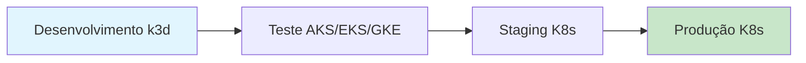

# K3D Local - Ambiente de Desenvolvimento Kubernetes

> 🚀 **Desenvolva Local, Deploy Global**: Ambiente de desenvolvimento local completo usando k3d, PostgreSQL persistente e aplicações automáticas. **100% compatível com qualquer cluster Kubernetes de produção** - AKS, EKS, GKE ou self-managed!

[](https://opensource.org/licenses/MIT)
[](https://k3d.io/)
[](https://www.postgresql.org/)
[](https://mariadb.org/)
[](https://redis.io/)
[](https://n8n.io/)
[](https://grafana.com/)
[](https://prometheus.io/)
[](https://glpi-project.org/)
[](https://cert-manager.io/)

## 🎯 **Status Atual - Infraestrutura Completa**

- ✅ **k3d Cluster**: 1 server + 2 agents + LoadBalancer com volume bind real
- ✅ **PostgreSQL 16**: Persistência hostPath + databases para n8n/grafana/prometheus
- ✅ **MariaDB 12.0.2**: Banco dedicado GLPI + persistência hostPath
- ✅ **Redis 8.2.3**: Cache compartilhado com databases separados (DB0-DB3)
- ✅ **n8n 1.118.2**: HTTPS + TLS automático + PostgreSQL + Redis cache
- ✅ **Grafana 12.2.1**: Dashboards + PostgreSQL + Redis + auto-scaling
- ✅ **Prometheus v3.7.3**: Métricas + alertas + PostgreSQL + Redis cache
- ✅ **GLPI 11.0.1**: Service Desk + MariaDB + Redis cache + HTTPS
- ✅ **cert-manager v1.19.0**: Certificados TLS auto-renováveis
- ✅ **Sistema de Backup**: PostgreSQL + MariaDB + PVCs com persistência real
- ✅ **Namespaces Organizados**: postgres, mariadb, redis, n8n, grafana, prometheus, glpi, cert-manager
- ✅ **Permissões Configuradas**: fsGroup correto para todos os componentes
- ✅ **TRUE PaaS BEHAVIOR**: Dados sobrevivem à destruição/recriação do cluster
- ✅ **Scripts de Limpeza**: Destruição completa e segura do ambiente

## 🌐 **Pontos de Acesso**

| Serviço        | URL/Endpoint                                     | Porta | Tipo      |
| -------------- | ------------------------------------------------ | ----- | --------- |
| **n8n**        | `https://n8n.local.127.0.0.1.nip.io:8443`        | 8443  | HTTPS/TLS |
| **Grafana**    | `https://grafana.local.127.0.0.1.nip.io:8443`    | 8443  | HTTPS/TLS |
| **Prometheus** | `https://prometheus.local.127.0.0.1.nip.io:8443` | 8443  | HTTPS/TLS |
| **GLPI**       | `https://glpi.local.127.0.0.1.nip.io:8443`       | 8443  | HTTPS/TLS |
| **PostgreSQL** | `localhost:30432`                                | 30432 | NodePort  |
| **MariaDB**    | `localhost:30306`                                | 30306 | NodePort  |
| **Redis**      | `redis.redis.svc.cluster.local:6379`             | 6379  | ClusterIP |

> ⚠️ **Porta 8443**: k3d mapeia `443→8443` para evitar privilégios root  
> 🌐 **DNS nip.io**: Resolve automaticamente para 127.0.0.1 sem modificar /etc/hosts

## � **Configuração de Persistência**

### **⚠️ Dados Persistentes vs Temporários**

**🔴 Configuração Padrão (Temporária):**

- Dados salvos **dentro do cluster** (`/var/lib/rancher/k3s/storage/`)
- **Perdidos** quando cluster é destruído (`k3d cluster delete`)

**✅ Configuração Recomendada (Persistente):**

- Dados salvos em **`/home/dsm/cluster/`** (hostPath)
- **Sobrevivem** à destruição do cluster

### **🔧 Como Ativar Persistência Real**

```bash
# 1. Configurar templates com seu path
./infra/scripts/13.configure-hostpath.sh

# 2. Criar estrutura de diretórios
./infra/scripts/9.setup-directories.sh

# 3. Deploy com persistência
./start-all.sh
```

**📁 Estrutura de dados persistente:**

```
/home/dsm/cluster/
├── postgresql/
│   ├── data/                     # PostgreSQL databases (n8n + grafana + prometheus)
│   └── backup/                   # Backups automáticos
├── mariadb/                      # MariaDB database (GLPI) - fsGroup: 999
├── redis/                        # Redis cache (compartilhado) - DB0-DB3
├── applications/
│   ├── n8n/
│   │   ├── data/                # n8n workflows - fsGroup: 1001
│   │   └── user-data/           # n8n user files
│   ├── grafana/
│   │   ├── data/                # Grafana dashboards - fsGroup: 472
│   │   └── plugins-dashboards/  # Grafana plugins
│   ├── prometheus/
│   │   ├── data/                # Prometheus time-series data
│   │   └── config/              # Prometheus configurações
│   └── glpi/
│       ├── data/                # GLPI dados principais - fsGroup: 1000
│       ├── config/              # GLPI configurações
│       └── files/               # GLPI uploads e anexos
└── pvc/                         # PVCs dinâmicos
```

> ⚠️ **Permissões Importantes**: Cada aplicação possui fsGroup específico configurado no deployment para garantir acesso correto aos volumes persistentes.

## �📋 Sumário

- [Pré-requisitos](#-pré-requisitos) ⚠️ **LEIA PRIMEIRO (Windows/WSL2)**
- [Instalação](#-instalação)
- [Visão Geral](#-visão-geral)
- [Por que k3d?](#-por-que-k3d-pensando-em-produção)
- [Configuração SSH](#-configuração-ssh-para-github-opcional)
- [Início Rápido](#-início-rápido---uso-diário)
- [Documentação Modular](#-documentação-modular)
- [Aplicações Disponíveis](#-aplicações-disponíveis)
- [Scripts Disponíveis](#-scripts-disponíveis)
- [Solução de Problemas](#-solução-de-problemas)
- [Deploy para Produção](#-deploy-para-produção)
- [Contribuindo](#-contribuindo-e-fork-do-projeto)

## 🏗️ **Arquitetura Dual-Database**

Este projeto implementa uma **arquitetura dual-database** otimizada para diferentes necessidades:

### **📊 PostgreSQL 16** (Aplicações Avançadas)

- **N8N**: Workflows complexos, JSON fields, extensões
- **Grafana**: Dashboards, alertas, configurações avançadas
- **Prometheus**: Time-series data, métricas, alertas
- **Recursos**: JSONB, arrays, extensões, performance otimizada

### **🗄️ MariaDB 12.0.2** (Aplicações Tradicionais)

- **GLPI**: Compatibilidade oficial MySQL/MariaDB
- **Recursos**: Transações ACID, relações tradicionais, compatibilidade

### **⚡ Redis 8.2.3** (Cache Compartilhado)

- **Database 0**: N8N cache e sessões
- **Database 1**: Grafana cache
- **Database 2**: GLPI cache e sessões
- **Database 3**: Prometheus cache

> 💡 **Vantagem**: Cada aplicação usa o banco ideal para suas necessidades, mantendo performance e compatibilidade máximas.

## 🔐 **Permissões e Segurança**

### **Configuração de fsGroup por Aplicação**

| Aplicação      | fsGroup | Proprietário Pasta          | Localização                                  |
| -------------- | ------- | --------------------------- | -------------------------------------------- |
| **PostgreSQL** | 999     | `postgres:postgres`         | `/home/dsm/cluster/postgresql/`              |
| **MariaDB**    | 999     | `systemd-coredump:ssh_keys` | `/home/dsm/cluster/mariadb/`                 |
| **N8N**        | 1001    | `n8n:n8n`                   | `/home/dsm/cluster/applications/n8n/`        |
| **Grafana**    | 472     | `grafana:grafana`           | `/home/dsm/cluster/applications/grafana/`    |
| **Prometheus** | 65534   | `nobody:nogroup`            | `/home/dsm/cluster/applications/prometheus/` |
| **GLPI**       | 1000    | `dsm:dsm`                   | `/home/dsm/cluster/applications/glpi/`       |
| **Redis**      | 999     | `redis:redis`               | `/home/dsm/cluster/redis/`                   |

### **🛡️ Segurança de Credenciais**

- **`.gitignore`**: Padrões configurados para proteger secrets
- **Templates**: Arquivos `.template` para configuração segura
- **Secrets K8s**: Credenciais gerenciadas via Kubernetes secrets
- **Volumes**: Permissões específicas por aplicação

> ⚠️ **IMPORTANTE**: Sempre verifique as permissões das pastas `/home/dsm/cluster/` antes do primeiro deploy!

## � Pré-requisitos

### **🐳 Docker Desktop (Windows/WSL2)**

> ⚠️ **IMPORTANTE**: Se você está usando Windows com WSL2, é **obrigatório** ter o Docker Desktop instalado e rodando!

#### **Windows + WSL2:**

```bash
# 1. Instalar Docker Desktop para Windows
# Download: https://docs.docker.com/desktop/windows/install/

# 2. Verificar se Docker Desktop está rodando
docker version
# Deve mostrar Client e Server version

# 3. Verificar integração WSL2
docker context ls
# Deve mostrar 'default' como atual
```

#### **❌ Problema Comum:**

```bash
k3d cluster list
# ERRO: Cannot connect to the Docker daemon at unix:///var/run/docker.sock
```

**✅ Solução:**

1. **Abrir Docker Desktop** no Windows
2. **Aguardar** inicialização completa (ícone azul na system tray)
3. **Verificar** integração WSL2: Settings → Resources → WSL Integration
4. **Habilitar** para sua distribuição WSL2

#### **🔧 Configuração WSL2 Integration:**

- Docker Desktop → Settings → Resources → WSL Integration
- ✅ Enable integration with my default WSL distro
- ✅ Enable integration with additional distros: **Sua distribuição**

### **🛠️ Outros Pré-requisitos:**

- **kubectl**: Cliente Kubernetes
- **k3d**: Kubernetes in Docker
- **git**: Controle de versão

## �🚀 Instalação

### **📥 Opção 1: Clone via HTTPS (Simples)**

```bash
# Clone o repositório via HTTPS
git clone https://github.com/SEU_USUARIO/k3d-local-development.git
cd k3d-local-development
```

### **📥 Opção 2: Clone via SSH (Recomendado)**

````bash
```bash
# Clone o repositório via SSH (requer configuração SSH)
git clone git@github.com:SEU_USUARIO/k3d-local-development.git
cd k3d-local-development

# OU Clone via HTTPS (pede senha/token)
git clone https://github.com/SEU_USUARIO/k3d-local-development.git
cd k3d-local-development
````

> 💡 **SSH é melhor para desenvolvimento**: Não pede senha, mais seguro. Veja [seção SSH](#-configuração-ssh-para-github-opcional) abaixo.
>
> ⚠️ **IMPORTANTE**: Substitua `SEU_USUARIO` pelo seu usuário real do GitHub!

### **⚙️ Configuração Inicial:**

```bash
# 1. Navegue para o diretório do projeto (exemplo)
cd /caminho/para/seu/projeto/k3d-local-development

# 2. Liberar execução dos scripts (comando único para todos)
find . -name "*.sh" -type f -exec chmod +x {} \;

# 3. Configure as credenciais (OBRIGATÓRIO - veja seção abaixo)
cp infra/postgres/postgres-secret-admin.yaml.template \
   infra/postgres/postgres-secret-admin.yaml

cp k8s/apps/n8n/n8n-secret-db.yaml.template \
   k8s/apps/n8n/n8n-secret-db.yaml

# 4. Edite os arquivos e substitua YOUR_POSTGRES_ADMIN_PASSWORD_HERE
nano infra/postgres/postgres-secret-admin.yaml
nano k8s/apps/n8n/n8n-secret-db.yaml

# 5. Execute o ambiente completo
./start-all.sh

# OU execute por partes:
# ./infra/scripts/9.start-infra.sh        # Somente infraestrutura
# ./k8s/apps/n8n/scripts/3.start-n8n.sh   # Somente n8n
```

> ⚠️ **Substitua o caminho**: Use o caminho real onde você clonou o projeto!

````

> 💡 **SSH é melhor para desenvolvimento**: Não pede senha, mais seguro. Veja [seção SSH](#-configuração-ssh-para-github-opcional) abaixo.

### **⚙️ Configuração Inicial:**

```bash
# 1. Liberar execução dos scripts (comando único para todos)
find . -name "*.sh" -type f -exec chmod +x {} \;

# 2. Configure as credenciais (OBRIGATÓRIO - veja seção abaixo)
cp infra/postgres/postgres-secret-admin.yaml.template \
   infra/postgres/postgres-secret-admin.yaml

cp k8s/apps/n8n/n8n-secret-db.yaml.template \
   k8s/apps/n8n/n8n-secret-db.yaml

cp k8s/apps/grafana/grafana-secret-db.yaml.template \
   k8s/apps/grafana/grafana-secret-db.yaml

# 3. Edite os arquivos e configure credenciais reais
nano infra/postgres/postgres-secret-admin.yaml     # PostgreSQL admin
nano k8s/apps/n8n/n8n-secret-db.yaml              # n8n database config
nano k8s/apps/grafana/grafana-secret-db.yaml       # Grafana database config

# 4. Execute o ambiente completo
./start-all.sh

# OU execute por partes:
# ./infra/scripts/9.start-infra.sh        # Somente infraestrutura
# ./k8s/apps/n8n/scripts/3.start-n8n.sh   # Somente n8n
````

> **Substitua `SEU_USUARIO`** pelo usuário correto do GitHub!

## 🎯 Visão Geral

Este projeto configura um ambiente de desenvolvimento local completo usando:

- **k3d**: Cluster Kubernetes local leve
- **PostgreSQL**: Banco de dados persistente
- **n8n**: Plataforma de automação de workflows
- **Traefik**: Ingress controller (padrão do k3d)
- **cert-manager**: Gerenciamento de certificados TLS self-signed
- **Storage persistente**: PVCs automáticos com local-path (padrão k3d)

## 🚀 Por que k3d? Pensando em Produção

### **🎯 Filosofia: "Desenvolva como Deploy"**

Este projeto usa **k3d** (Kubernetes in Docker) com uma filosofia clara: **criar um ambiente de desenvolvimento que seja o mais próximo possível da produção**.

### **✅ Vantagens do k3d:**

#### **1. 🏭 Compatibilidade Total com Produção**

- **Kubernetes real**: Não é simulação, é Kubernetes completo
- **APIs idênticas**: Mesmos comandos `kubectl` de produção
- **Manifests portáveis**: YAMLs funcionam em qualquer cluster K8s
- **Ingress real**: Traefik funciona igual ao ambiente produtivo

#### **2. 🌍 Path to Production Simplificado**



**Mesmos arquivos, ambientes diferentes:**

| Ambiente       | Cluster     | Manifests    | Comandos     |
| -------------- | ----------- | ------------ | ------------ |
| **Local**      | k3d         | ✅ Idênticos | ✅ Idênticos |
| **Cloud**      | AKS/EKS/GKE | ✅ Idênticos | ✅ Idênticos |
| **On-premise** | K8s vanilla | ✅ Idênticos | ✅ Idênticos |

#### **3. 🔄 Opções de Deploy em Produção**

**Clusters Gerenciados (Recomendado):**

- **Azure**: AKS (Azure Kubernetes Service)
- **AWS**: EKS (Elastic Kubernetes Service)
- **Google**: GKE (Google Kubernetes Engine)
- **Digital Ocean**: DOKS (DigitalOcean Kubernetes)

**Self-managed:**

- **On-premise**: K8s vanilla + kubeadm
- **Cloud VMs**: K8s em VMs (EC2, Compute Engine, etc.)

**Todos usam os MESMOS manifests YAML!**

#### **4. 💡 Facilidade de Migração**

```bash
# 🏠 Desenvolvimento local (k3d)
kubectl apply -f k8s/apps/n8n/

# 🌍 Produção AKS
kubectl apply -f k8s/apps/n8n/

# 🚀 Produção EKS
kubectl apply -f k8s/apps/n8n/

# ⚡ Produção GKE
kubectl apply -f k8s/apps/n8n/
```

**Mesmo código, diferentes infraestruturas!**

#### **5. 🧪 Validação Completa Local**

- **Networking**: Testa ingress, services, DNS interno
- **Storage**: Volumes persistentes funcionam igual produção
- **Secrets**: Gerenciamento de credenciais como produção
- **Scaling**: HPA e resource limits testáveis
- **TLS**: Certificados e HTTPS funcionando

### **🆚 Comparação com Alternativas**

| Ferramenta         | Kubernetes Real | Portabilidade | Learning Curve | Produção-Ready |
| ------------------ | --------------- | ------------- | -------------- | -------------- |
| **k3d**            | ✅ 100%         | ✅ Total      | 🟡 Média       | ✅ Sim         |
| **minikube**       | ✅ 100%         | ✅ Total      | 🟡 Média       | ✅ Sim         |
| **kind**           | ✅ 100%         | ✅ Total      | 🟡 Média       | ✅ Sim         |
| **docker-compose** | ❌ Não          | ❌ Limitada   | 🟢 Baixa       | ❌ Não         |
| **VM local**       | ✅ Depende      | 🟡 Parcial    | 🔴 Alta        | 🟡 Talvez      |

### **🎓 Aprendizado Transferível**

Ao dominar este ambiente, você aprende:

- **kubectl**: CLI oficial do Kubernetes
- **YAML manifests**: Padrão da indústria
- **Ingress**: Roteamento HTTP/HTTPS
- **Secrets**: Gerenciamento seguro de credenciais
- **Volumes**: Storage persistente
- **Networking**: Service discovery e DNS

**Conhecimento 100% aplicável em qualquer ambiente Kubernetes!**

## 🛠 Pré-requisitos

### Software Necessário

- **Docker Desktop** com WSL2 habilitado
- **kubectl** ([instalação](https://kubernetes.io/docs/tasks/tools/install-kubectl-linux/))
- **k3d** v5.8.3+ ([instalação](https://k3d.io/v5.8.0/#installation))

### Sistema

- **WSL2** com distribuição Linux
- **Storage Class**: local-path (automático k3d - sem configuração manual)

### **🔓 Permissões de Execução**

⚠️ **IMPORTANTE no Linux/WSL2**: Scripts precisam de permissão de execução.

```bash
# Comando único para liberar TODOS os scripts:
find . -name "*.sh" -type f -exec chmod +x {} \;

# Verificar se funcionou:
ls -la start-all.sh
# Deve mostrar: -rwxr-xr-x ... start-all.sh
```

> 💡 **Execute este comando SEMPRE após clonar o repositório!**

## 🐧 Configuração WSL2

⚠️ **IMPORTANTE**: Configure o WSL2 adequadamente para melhor performance.

📖 **Guia Completo**: Veja [`README-WSL2.md`](README-WSL2.md) para:

- Configuração otimizada do `.wslconfig`
- Sugestões de RAM e CPU por hardware
- Solução de problemas de performance
- Monitoramento de recursos

## 🔐 **IMPORTANTE: Configuração de Credenciais**

⚠️ **ANTES DE USAR**: Este repositório usa templates de segurança para proteger senhas.

### **Procedimento Obrigatório:**

```bash
# 1. Copiar templates (criar arquivos reais)
cp infra/postgres/postgres-secret-admin.yaml.template \
   infra/postgres/postgres-secret-admin.yaml

cp k8s/apps/n8n/n8n-secret-db.yaml.template \
   k8s/apps/n8n/n8n-secret-db.yaml

# 2. Gerar senha segura
openssl rand -base64 24

# 3. Editar AMBOS arquivos e substituir YOUR_POSTGRES_ADMIN_PASSWORD_HERE
nano infra/postgres/postgres-secret-admin.yaml
nano k8s/apps/n8n/n8n-secret-db.yaml
```

### **⚡ Verificação Automática:**

O script `start-all.sh` (ou scripts individuais) verifica automaticamente se as credenciais foram configuradas e exibe instruções caso contrário.

📖 **Detalhes completos**: Veja [`README-SECURITY.md`](README-SECURITY.md)

## � Documentação Modular

Esta documentação está organizada de forma modular para facilitar a manutenção e expansão:

### **📖 Documentos Principais**

| 📄 **Documento**                                           | 🎯 **Foco**           | 📋 **Conteúdo**                                    |
| ---------------------------------------------------------- | --------------------- | -------------------------------------------------- |
| **[README.md](README.md)**                                 | Overview geral        | Instalação, SSH, início rápido, visão geral        |
| **[README-MAIN.md](README-MAIN.md)**                       | Documentação completa | Guia completo do projeto                           |
| **[README-INFRA.md](README-INFRA.md)**                     | Infraestrutura        | k3d, PostgreSQL, MariaDB, Redis, cert-manager      |
| **[README-N8N.md](README-N8N.md)**                         | Aplicação n8n         | Deploy, configuração, workflows, troubleshooting   |
| **[README-GRAFANA.md](README-GRAFANA.md)**                 | Aplicação Grafana     | Deploy, dashboards, monitoramento, observabilidade |
| **[README-PROMETHEUS.md](README-PROMETHEUS.md)**           | Aplicação Prometheus  | Deploy, métricas, alertas, configuração            |
| **[README-GLPI.md](README-GLPI.md)**                       | Aplicação GLPI        | Deploy, service desk, ITSM, troubleshooting        |
| **[README-PERSISTENCE.md](README-PERSISTENCE.md)**         | Persistência de Dados | hostPath volumes, backup, configuração templates   |
| **[README-WSL2.md](README-WSL2.md)**                       | Configuração WSL2     | Otimização, performance, troubleshooting WSL2      |
| **[README-SECURITY.md](README-SECURITY.md)**               | Segurança             | Templates, credenciais, boas práticas              |
| **[DAILY-ROUTINE.md](DAILY-ROUTINE.md)**                   | Rotina Diária         | Comandos do dia a dia, manutenção                  |
| **[SCRIPT-ANALYSIS-REPORT.md](SCRIPT-ANALYSIS-REPORT.md)** | Análise Scripts       | Documentação detalhada dos 19 scripts              |

### **🔄 Quando Usar Cada Documento**

- **🆕 Primeiro uso?** → Comece com este **README.md**
- **📚 Documentação completa?** → Consulte **[README-MAIN.md](README-MAIN.md)**
- **🏗️ Problemas de infraestrutura?** → Consulte **[README-INFRA.md](README-INFRA.md)**
- **🔧 Questões específicas do n8n?** → Veja **[README-N8N.md](README-N8N.md)**
- **📊 Monitoramento e Grafana?** → Veja **[README-GRAFANA.md](README-GRAFANA.md)**
- **� Métricas e Prometheus?** → Veja **[README-PROMETHEUS.md](README-PROMETHEUS.md)**
- **🎫 Service Desk e GLPI?** → Veja **[README-GLPI.md](README-GLPI.md)**
- **�💾 Dados não persistem após destruir cluster?** → Veja **[README-PERSISTENCE.md](README-PERSISTENCE.md)**
- **💻 Configuração WSL2?** → Consulte **[README-WSL2.md](README-WSL2.md)**
- **🔐 Segurança e credenciais?** → Veja **[README-SECURITY.md](README-SECURITY.md)**
- **🗓️ Rotina diária de uso?** → Veja **[DAILY-ROUTINE.md](DAILY-ROUTINE.md)**
- **🔍 Análise de scripts?** → Veja **[SCRIPT-ANALYSIS-REPORT.md](SCRIPT-ANALYSIS-REPORT.md)**
- **📈 Expandindo para novas aplicações?** → Use os documentos como template

### **💡 Benefícios da Estrutura Modular**

- **🎯 Foco específico**: Cada documento trata de um aspecto bem definido
- **📚 Facilita manutenção**: Atualizações em seções específicas sem conflitos
- **🔄 Escalabilidade**: Fácil adicionar novos documentos para novas aplicações
- **🔍 Busca rápida**: Encontre informações específicas sem navegar por documento gigante

## 🚀 Aplicações Disponíveis

### **📦 Aplicações Implementadas**

| 🛠️ **Aplicação** | 📝 **Descrição**           | 🌐 **Acesso**                                        | 🔑 **Login**              | 📖 **Documentação**                              |
| ---------------- | -------------------------- | ---------------------------------------------------- | ------------------------- | ------------------------------------------------ |
| **n8n**          | Automação de workflows     | https://n8n.local.127.0.0.1.nip.io:8443              | Setup inicial             | **[README-N8N.md](README-N8N.md)**               |
| **Grafana**      | Monitoramento e dashboards | https://grafana.local.127.0.0.1.nip.io:8443          | admin / admin             | **[README-GRAFANA.md](README-GRAFANA.md)**       |
| **Prometheus**   | Métricas e alertas         | https://prometheus.local.127.0.0.1.nip.io:8443       | -                         | **[README-PROMETHEUS.md](README-PROMETHEUS.md)** |
| **GLPI**         | Service Desk e ITSM        | https://glpi.local.127.0.0.1.nip.io:8443             | glpi / glpi               | **[README-GLPI.md](README-GLPI.md)**             |
| **Redis**        | Cache & Session Store      | Interno (`redis.redis.svc.cluster.local:6379`)       | -                         | Cache para n8n/grafana/glpi/prometheus           |
| **PostgreSQL**   | Banco de dados (Apps)      | Interno (`postgres.postgres.svc.cluster.local:5432`) | postgres / postgres_admin | **[README-INFRA.md](README-INFRA.md)**           |
| **MariaDB**      | Banco de dados (GLPI)      | Interno (`mariadb.mariadb.svc.cluster.local:3306`)   | mariadb_admin / \*\*\*    | Base de dados para GLPI                          |

### **🔄 Adicionando Novas Aplicações**

```bash
# Template para nova aplicação
mkdir -p k8s/apps/NOVA_APP
cp -r k8s/apps/n8n/* k8s/apps/NOVA_APP/
# Editar manifests conforme necessário
# Criar README-NOVA_APP.md baseado no README-N8N.md
```

### **📋 Roadmap de Aplicações**

- **✅ n8n**: Automação de workflows (implementado)
- **✅ Grafana**: Dashboards e monitoring (implementado)
- **✅ Prometheus**: Métricas e alertas (implementado)
- **✅ GLPI**: Service Desk e ITSM (implementado)
- **✅ Redis**: Cache e sessões (implementado)
- **✅ PostgreSQL**: Base de dados para apps (implementado)
- **✅ MariaDB**: Base de dados para GLPI (implementado)

## �🔑 **Configuração SSH para GitHub (Opcional)**

🐧 **Para uso no WSL2**: Configure sua chave SSH dentro do ambiente Linux do WSL2.

💡 **Para clonar e fazer push via SSH** sem digitar senha:

### **1. Gerar Chave SSH (se não tiver)**

⚠️ **Execute dentro do WSL2** (terminal Linux):

```bash
# Gerar nova chave SSH (substitua seu email)
ssh-keygen -t rsa -b 4096 -C "seu_email@exemplo.com"

# Quando perguntado, salve como (exemplo):
# /home/seu_usuario/.ssh/github_seu_nome

# Adicionar ao agente SSH (necessário no WSL2)
eval "$(ssh-agent -s)"
ssh-add ~/.ssh/github_seu_nome
```

### **2. Adicionar Chave Pública ao GitHub**

```bash
# Copiar chave pública (no WSL2)
cat ~/.ssh/github_seu_nome.pub

# Vá em: GitHub → Settings → SSH and GPG Keys → New SSH Key
# Cole o conteúdo copiado
```

### **3. Configurar SSH (Recomendado)**

⚠️ **Importante para WSL2**: Configurar para usar automaticamente a chave.

```bash
# Criar arquivo ~/.ssh/config (dentro do WSL2)
nano ~/.ssh/config

# Adicionar configuração:
Host github.com
    HostName github.com
    User git
    IdentityFile ~/.ssh/github_seu_nome
    IdentitiesOnly yes

# Definir permissões corretas
chmod 600 ~/.ssh/config
```

### **4. Testar Conexão**

```bash
# Testar autenticação SSH (dentro do WSL2)
ssh -T git@github.com

# Deve retornar: "Hi SEU_USUARIO! You've successfully authenticated..."
```

### **5. Clonar/Push com SSH**

⚠️ **Execute no terminal WSL2**:

```bash
# Clonar via SSH (recomendado) - no WSL2
git clone git@github.com:USUARIO/REPOSITORIO.git

# Ou alterar remote existente para SSH
git remote set-url origin git@github.com:USUARIO/REPOSITORIO.git

# Verificar configuração do git (no WSL2)
git config --global user.name "Seu Nome"
git config --global user.email "seu_email@exemplo.com"
```

💡 **Vantagens do SSH**: Não precisa digitar senha, mais seguro, suporte a commits automáticos.

### **🔄 Persistência SSH no WSL2**

⚠️ **Importante**: O agente SSH pode parar quando o WSL2 é reiniciado.

**Solução Automática** - Adicione ao `~/.bashrc` ou `~/.zshrc`:

```bash
# Adicionar ao final do arquivo ~/.bashrc (no WSL2)
echo '
# Auto-start SSH agent and add key
if [ -z "$SSH_AUTH_SOCK" ]; then
    eval "$(ssh-agent -s)" > /dev/null
    ssh-add ~/.ssh/github_seu_nome 2>/dev/null
fi
' >> ~/.bashrc

# Recarregar configuração
source ~/.bashrc
```

**Verificação**:

```bash
# Após reiniciar WSL2, testar se ainda funciona
ssh -T git@github.com
```

### Verificação dos Pré-requisitos

⚠️ **Execute dentro do WSL2** (não no PowerShell/CMD do Windows):

```bash
# Verificar Docker (deve estar integrado ao WSL2)
docker --version

# Verificar kubectl
kubectl version --client

# Verificar k3d
k3d version

# Verificar se Docker está funcionando
docker ps

# Verificar se está no WSL2
uname -a
# Deve mostrar: Linux ... Microsoft ...
```

## 📁 Estrutura do Projeto

```
brioit_local/
├── 📖 README.md                    # Este arquivo (overview geral)
├── 📖 README-MAIN.md               # Documentação principal completa
├── 📖 README-INFRA.md              # Documentação de infraestrutura
├── 📖 README-N8N.md                # Documentação n8n (workflows)
├── 📖 README-GRAFANA.md            # Documentação Grafana (dashboards)
├── 📖 README-PROMETHEUS.md         # Documentação Prometheus (métricas)
├── 📖 README-GLPI.md               # Documentação GLPI (service desk)
├── 📖 README-PERSISTENCE.md        # Documentação de persistência
├── 📖 README-SECURITY.md           # Documentação de segurança
├── 📖 README-WSL2.md               # Documentação WSL2
├── 📖 DAILY-ROUTINE.md             # Rotina diária de uso
├── 📖 SCRIPT-ANALYSIS-REPORT.md   # Análise de scripts
├── 🚀 start-all.sh                 # Script principal (infraestrutura + aplicações)
├── infra/                          # Infraestrutura base
│   ├── k3d/                        # Configuração do cluster k3d
│   │   └── k3d-config.yaml         # Config: 3 nodes, hostPath /home/dsm/cluster
│   ├── cert-manager/               # Certificados TLS
│   ├── postgres/                   # PostgreSQL (n8n, grafana, prometheus)
│   ├── mariadb/                    # MariaDB (GLPI)
│   ├── redis/                      # Redis (cache para todas apps)
│   └── scripts/                    # 19 scripts de infraestrutura
│       ├── 1.create-infra.sh      # Cria infraestrutura completa
│       ├── 2.destroy-infra.sh     # Destrói infraestrutura
│       ├── 10.start-infra.sh      # Inicia infra (usado pelo start-all.sh)
│       ├── 14.clean-cluster-data.sh    # Drop databases (cluster rodando)
│       ├── 15.clean-cluster-pvc.sh     # Limpa filesystem (cluster parado)
│       ├── 18.destroy-all.sh           # Orquestra destruição completa
│       └── 19.test-persistence.sh      # Testa persistência
├── k8s/                           # Aplicações Kubernetes
│   └── apps/
│       ├── n8n/                   # n8n (automação de workflows)
│       │   ├── manifests/         # YAMLs: deployment, service, ingress, PV/PVC
│       │   └── scripts/           # Scripts de deploy/destroy
│       ├── grafana/               # Grafana (dashboards e monitoring)
│       │   ├── manifests/         # YAMLs: deployment, service, ingress, PV/PVC
│       │   └── scripts/           # Scripts de deploy/destroy
│       ├── prometheus/            # Prometheus (métricas e alertas)
│       │   ├── manifests/         # YAMLs: deployment, service, ingress, PV/PVC
│       │   └── scripts/           # Scripts de deploy/destroy
│       └── glpi/                  # GLPI (service desk e ITSM)
│           ├── manifests/         # YAMLs: deployment, service, ingress, PV/PVC
│           └── scripts/           # Scripts de deploy/destroy
└── backup/                        # Scripts de backup
    ├── scripts/                   # Scripts de backup automático
    └── cronjobs/                  # CronJobs para backups agendados
```

> 📚 **Detalhes completos da estrutura**: Consulte **[README-INFRA.md](README-INFRA.md)** para informações detalhadas sobre cada componente da infraestrutura.

## 🚀 Início Rápido - Uso Diário

### **📋 Scripts Disponíveis:**

```bash
# 🎯 OPÇÃO 1: Deploy completo (infraestrutura + aplicações)
./start-all.sh                       # Deploy completo: infra + n8n + grafana
./start-all.sh n8n                   # Deploy infra + somente n8n
./start-all.sh grafana               # Deploy infra + somente grafana

# 🎯 OPÇÃO 2: Deploy manual por componente
./infra/scripts/10.start-infra.sh                # k3d + PostgreSQL + MariaDB + Redis + cert-manager
./k8s/apps/n8n/scripts/3.start-n8n.sh            # Deploy n8n (requer infra)
./k8s/apps/grafana/scripts/3.start-grafana.sh    # Deploy grafana (requer infra)
./k8s/apps/prometheus/scripts/3.start-prometheus.sh  # Deploy prometheus (requer infra)
./k8s/apps/glpi/scripts/3.start-glpi.sh          # Deploy glpi (requer infra)

# 🎯 OPÇÃO 3: Limpeza completa e segura
./infra/scripts/18.destroy-all.sh    # Orquestra: drop DB → destroy cluster → clean filesystem
# OU passo a passo:
./infra/scripts/14.clean-cluster-data.sh  # Drop databases (cluster rodando)
./infra/scripts/2.destroy-infra.sh        # Destroy cluster
./infra/scripts/15.clean-cluster-pvc.sh   # Clean filesystem (cluster parado)

# 🗑️ OPÇÃO 4: Verificação de status
kubectl get all --all-namespaces       # Ver todos os recursos
kubectl get pods -n n8n                # Status do n8n
kubectl get pods -n grafana            # Status do grafana
kubectl get pods -n prometheus         # Status do prometheus
kubectl get pods -n glpi               # Status do glpi
kubectl get pods -n postgres           # Status do PostgreSQL
kubectl get pods -n mariadb            # Status do MariaDB
kubectl get pods -n redis              # Status do Redis
```

> ⚠️ **Se aparecer "Permission denied"**: Execute `find . -name "*.sh" -type f -exec chmod +x {} \;` primeiro!

### **🧠 Processo Automatizado:**

| Script                    | O que faz                                                 | Tempo |
| ------------------------- | --------------------------------------------------------- | ----- |
| **start-all.sh**          | Deploy completo: infra + todas apps                       | ~5min |
| **10.start-infra.sh**     | k3d cluster + PostgreSQL + MariaDB + Redis + cert-manager | ~2min |
| **3.start-n8n.sh**        | n8n 1.118.2 + TLS + Redis cache + hosts                   | ~1min |
| **3.start-grafana.sh**    | Grafana 12.2.1 + TLS + PostgreSQL + hosts                 | ~1min |
| **3.start-prometheus.sh** | Prometheus v3.7.3 + TLS + métricas + hosts                | ~1min |
| **3.start-glpi.sh**       | GLPI 11.0.1 + MariaDB + Redis + hosts                     | ~1min |
| **18.destroy-all.sh**     | Destruição completa: drop DB → destroy → clean filesystem | ~2min |
| **2.destroy-infra.sh**    | Remove cluster completo (dados preservados em hostPath)   | ~30s  |

### **💡 Fluxo de Uso Típico:**

```bash
# ☀️ Primeira execução (deploy completo)
./start-all.sh                       # Infraestrutura + todas aplicações

# 🔄 Deploy aplicação específica
./start-all.sh n8n                   # Somente n8n
./start-all.sh grafana               # Somente grafana
./start-all.sh prometheus            # Somente prometheus
./start-all.sh glpi                  # Somente glpi

# 🛠️ Manutenção (remover aplicação mantendo dados)
./k8s/apps/n8n/scripts/2.destroy-n8n.sh         # Remove n8n (dados preservados)
./k8s/apps/grafana/scripts/2.destroy-grafana.sh # Remove grafana (dados preservados)
./k8s/apps/prometheus/scripts/2.destroy-prometheus.sh # Remove prometheus (dados preservados)
./k8s/apps/glpi/scripts/2.destroy-glpi.sh       # Remove glpi (dados preservados)

# 🔄 Reiniciar ambiente (se necessário)
./infra/scripts/2.destroy-infra.sh
./start-all.sh

# 🗑️ Limpeza COMPLETA (remove tudo incluindo dados)
./infra/scripts/18.destroy-all.sh    # Drop databases → Destroy cluster → Clean filesystem
```

### **🌐 Acesso às Aplicações:**

| Serviço        | URL                                              | Credenciais                              |
| -------------- | ------------------------------------------------ | ---------------------------------------- |
| **n8n**        | `https://n8n.local.127.0.0.1.nip.io:8443`        | Configurar no primeiro acesso            |
| **Grafana**    | `https://grafana.local.127.0.0.1.nip.io:8443`    | admin / admin                            |
| **Prometheus** | `https://prometheus.local.127.0.0.1.nip.io:8443` | Interface de métricas                    |
| **GLPI**       | `https://glpi.local.127.0.0.1.nip.io:8443`       | glpi / glpi                              |
| **PostgreSQL** | `localhost:30432`                                | user: `admin`, senha: definida no secret |
| **MariaDB**    | `localhost:30306`                                | user: `mariadb_admin`, senha: no secret  |

### **� Configuração da Porta 8443**

A porta **8443** é usada porque:

- ✅ **Sem privilégios root**: Portas < 1024 requerem sudo
- ✅ **k3d mapping**: `443 (cluster) → 8443 (host)`
- ✅ **Configuração**: Definida em `/infra/k3d/k3d-config.yaml`

```yaml
# /infra/k3d/k3d-config.yaml
ports:
  - port: 8443:443 # HTTPS: Host:8443 → Cluster:443
```

> **💪 Scripts inteligentes: Auto-configuram /etc/hosts e verificam certificados TLS automaticamente!**

### 📋 **Método Manual (passo a passo):**

#### 1. Setup Completo da Infraestrutura

```bash
# Criar cluster + PostgreSQL + cert-manager
./infra/scripts/1.create-infra.sh
```

#### 2. Deploy do n8n

```bash
# Deploy da aplicação n8n
./k8s/scripts/1.deploy-n8n.sh
```

## 📅 **Fluxo de Trabalho Diário**

### 🌅 **Toda manhã (ou após reiniciar laptop/WSL2):**

```bash
# 1. Abrir WSL e navegar até o projeto
cd /home/dsm/brioit_local

# 2. Executar script de inicialização (detecta o que precisa fazer)
./start-all.sh

# 3. Aguardar mensagem "Ambiente pronto!" (15s ~ 3min dependendo do estado)

# 4. Abrir browser e acessar:
# https://n8n.local.127.0.0.1.nip.io:8443
```

### ☕ **Durante o dia:**

- **Apenas acessar o browser**: `https://n8n.local.127.0.0.1.nip.io:8443`
- **Não precisa rodar scripts novamente**

### 🔄 **Cenários Comuns:**

```bash
# 🌅 Ligou o computador / Primeira vez
./start-all.sh  # Cria tudo automaticamente

# 💻 Reiniciou WSL2 / Docker Desktop
./start-all.sh  # Detecta e reinicia serviços

# 🔧 Quer limpar tudo e começar do zero
./infra/scripts/2.destroy-infra.sh  # Remove tudo
./start-all.sh     # Recria do zero

# ✅ Verificar se está funcionando
./start-all.sh  # Mostra status atual
```

## 🔧 **Métodos Alternativos**

### 3. Acessar as Aplicações

**🔒 n8n (HTTPS - Recomendado):**

```bash
# URL principal com TLS
https://n8n.local.127.0.0.1.nip.io:8443
```

**🚀 n8n (Port-forward - Alternativa):**

```bash
# Para desenvolvimento/debug
kubectl port-forward svc/n8n 9090:5678 -n n8n
# Acesso: http://localhost:9090
```

**⚠️ Configuração necessária:**

```bash
# Adicionar ao /etc/hosts para resolver o domínio
echo '127.0.0.1 n8n.local.127.0.0.1.nip.io' | sudo tee -a /etc/hosts
```

### 4. Verificar Status

```bash
# Status do cluster
kubectl get nodes

# Status dos pods
kubectl get pods --all-namespaces

# Status dos ingress
kubectl get ingress --all-namespaces
```

## 🏗 Componentes

### Cluster k3d

- **Nome**: `k3d-cluster`
- **Configuração**: 1 server + 2 agents
- **Portas expostas**: 8080:80, 8443:443
- **Storage**: local-path StorageClass (automático k3d)

### PostgreSQL

- **Versão**: 16
- **Namespace**: default
- **Service**: `postgres.default.svc.cluster.local:5432`
- **Dados persistentes**: PVC automático (gerenciado pelo k3d)
- **Recursos**: 200m CPU, 256Mi RAM

### n8n

- **Versão**: 1.111.1
- **Namespace**: n8n
- **URL**: https://n8n.local.127.0.0.1.nip.io
- **Banco**: PostgreSQL (configurado via secrets)
- **Recursos**: 100m-500m CPU, 250Mi-1Gi RAM
- **Auto-scaling**: HPA configurado (1-5 replicas)
  - Escala por CPU (70%) e Memória (80%)
  - Estabilização: 60s para scale-up, 300s para scale-down

#### 🔒 Acessando o n8n

**HTTPS (Recomendado - TLS ativo):**

```bash
# URL principal com certificado TLS
https://n8n.local.127.0.0.1.nip.io:8443
```

**⚠️ Nota sobre certificados:** Como usamos certificado self-signed, seu browser mostrará um aviso de "conexão não segura". Clique em **"Avançado"** → **"Continuar para o site"**.

**Port-forward (Alternativa para desenvolvimento):**

```bash
# Em caso de problemas com ingress/TLS
kubectl port-forward svc/n8n 9090:5678 -n n8n

# Acesso via: http://localhost:9090
```

**Configuração do /etc/hosts:**

```bash
# Necessário para resolução do domínio local
echo '127.0.0.1 n8n.local.127.0.0.1.nip.io' | sudo tee -a /etc/hosts
```

### cert-manager

- **Namespace**: cert-manager
- **Issuer**: self-signed (para desenvolvimento local)
- **Certificados**: Gerados automaticamente para ingress

## 📜 Scripts Disponíveis

### **🚀 Script Principal (Uso Diário)**

```bash
# ÚNICO comando necessário para inicializar tudo
./start-all.sh
```

> **Script inteligente**: Detecta automaticamente o estado atual e executa apenas o necessário.

### **🔧 Scripts Específicos**

### **🔧 Scripts Específicos**

| **Categoria**                  | **Script**                                          | **Função**                                                         |
| ------------------------------ | --------------------------------------------------- | ------------------------------------------------------------------ |
| **🚀 Deploy Completo**         | `start-all.sh`                                      | Infraestrutura + todas aplicações (n8n, grafana, prometheus, glpi) |
| **🏗️ Infraestrutura**          | `infra/scripts/10.start-infra.sh`                   | Cluster + PostgreSQL + MariaDB + Redis + cert-manager              |
| **🎯 Aplicação n8n**           | `k8s/apps/n8n/scripts/3.start-n8n.sh`               | Deploy n8n com HTTPS                                               |
| **📊 Aplicação Grafana**       | `k8s/apps/grafana/scripts/3.start-grafana.sh`       | Deploy Grafana com HTTPS                                           |
| **� Aplicação Prometheus**     | `k8s/apps/prometheus/scripts/3.start-prometheus.sh` | Deploy Prometheus com HTTPS                                        |
| **🎫 Aplicação GLPI**          | `k8s/apps/glpi/scripts/3.start-glpi.sh`             | Deploy GLPI com HTTPS                                              |
| **�🗑️ Limpeza Infra**          | `infra/scripts/2.destroy-infra.sh`                  | Remove cluster (mantém dados hostPath)                             |
| **🧪 Teste Persistência**      | `infra/scripts/19.test-persistence.sh`              | Testa que dados sobrevivem destroy cluster                         |
| **💥 Destruição Completa**     | `infra/scripts/18.destroy-all.sh`                   | Remove cluster + databases + filesystem (limpeza total)            |
| **🧹 Limpeza Databases**       | `infra/scripts/14.clean-cluster-data.sh`            | Drop databases PostgreSQL e MariaDB (requer cluster ativo)         |
| **📂 Limpeza Filesystem**      | `infra/scripts/15.clean-cluster-pvc.sh`             | Remove dados hostPath (requer cluster parado)                      |
| **🗑️ Limpeza Aplicações**      | `k8s/apps/*/scripts/2.destroy-*.sh`                 | Remove app (mantém dados)                                          |
| **💥 Drop Database Aplicação** | `k8s/apps/*/scripts/4.drop-database-*.sh`           | Remove PERMANENTEMENTE dados da aplicação                          |

> 📚 **Lista completa de scripts**: Consulte **[SCRIPT-ANALYSIS-REPORT.md](SCRIPT-ANALYSIS-REPORT.md)** para todos os 19 scripts disponíveis com descrições detalhadas e fluxos de trabalho.

## 🔧 Solução de Problemas

### **� Problemas Docker Desktop (Windows/WSL2)**

#### Cannot connect to the Docker daemon

```bash
# ERRO comum:
k3d cluster list
# FATA[0000] runtime failed to list nodes: docker failed to get containers
# Cannot connect to the Docker daemon at unix:///var/run/docker.sock

# ✅ SOLUÇÃO:
```

**Passo a passo:**

1. **Abrir Docker Desktop** no Windows
2. **Aguardar** inicialização completa (ícone Docker azul na system tray)
3. **Verificar integração WSL2**:
   - Docker Desktop → Settings → Resources → WSL Integration
   - ✅ Enable integration with my default WSL distro
   - ✅ Enable integration with additional distros
4. **Reiniciar terminal WSL2**
5. **Testar**: `docker version` deve mostrar Client e Server

#### Docker Desktop não inicia

```bash
# Verificar se Hyper-V e WSL2 estão habilitados
wsl --status
# Deve mostrar WSL2 como versão padrão

# Se necessário, definir WSL2 como padrão:
wsl --set-default-version 2
```

#### k3d cluster não cria

```bash
# ERRO: k3d cluster create falha
# SOLUÇÃO: Verificar recursos do Docker

# 1. Docker Desktop → Settings → Resources
# 2. Alocar pelo menos:
#    - Memory: 4GB
#    - CPUs: 2
#    - Disk: 20GB
# 3. Apply & Restart Docker Desktop
```

### **�🚫 Problemas de Execução de Scripts**

#### Permission denied ao executar scripts

```bash
# Solução: Liberar execução de TODOS os scripts
find . -name "*.sh" -type f -exec chmod +x {} \;

# Verificar permissões
ls -la infra/scripts/9.start-n8n.sh
# Deve mostrar: -rwxr-xr-x
```

#### Scripts não executam no Windows

```bash
# ERRO: Scripts .sh não funcionam no PowerShell/CMD
# SOLUÇÃO: Usar SEMPRE o WSL2

# 1. Abrir WSL2 (Windows Terminal → Ubuntu/Debian)
# 2. Navegar até o projeto
cd /home/seu_usuario/k3d-local-development
# 3. Executar scripts normalmente
./start-all.sh
```

### **🔑 Problemas SSH (GitHub)**

#### Permission denied (publickey)

```bash
# 1. Verificar se a chave está carregada
ssh-add -l

# 2. Se vazio, adicionar chave
eval "$(ssh-agent -s)"
ssh-add ~/.ssh/github_seu_nome

# 3. Testar conexão
ssh -T git@github.com
```

#### Git ainda pede senha

```bash
# Mudar de HTTPS para SSH
git remote set-url origin git@github.com:USUARIO/REPOSITORIO.git
```

### **🏗️ Problemas de Infraestrutura**

```bash
# Cluster não inicia
docker ps                              # Verificar Docker
./infra/scripts/2.destroy-infra.sh     # Destruir cluster
./infra/scripts/10.start-infra.sh      # Recriar cluster

# PostgreSQL não conecta
kubectl get pods -n postgres           # Verificar status
kubectl logs postgres-0 -n postgres    # Verificar logs

# MariaDB não conecta (GLPI)
kubectl get pods -n mariadb            # Verificar status
kubectl logs mariadb-0 -n mariadb      # Verificar logs

# Redis não conecta
kubectl get pods -n redis              # Verificar status
kubectl logs deployment/redis -n redis # Verificar logs

# Aplicações não carregam
kubectl get pods -n n8n                # n8n status
kubectl get pods -n grafana            # grafana status
kubectl get pods -n prometheus         # prometheus status
kubectl get pods -n glpi               # glpi status

# Ver logs de aplicação específica
kubectl logs -f deployment/n8n -n n8n
kubectl logs -f deployment/grafana -n grafana
kubectl logs -f deployment/prometheus -n prometheus
kubectl logs -f deployment/glpi -n glpi
```

### **📚 Troubleshooting Específico**

Para problemas específicos, consulte a documentação modular:

- **🏗️ Infraestrutura (k3d, PostgreSQL, MariaDB, Redis, cert-manager)**: **[README-INFRA.md](README-INFRA.md)**
- **🎯 Aplicação n8n (deployment, acesso, workflows)**: **[README-N8N.md](README-N8N.md)**
- **📊 Aplicação Grafana (deployment, dashboards, datasources)**: **[README-GRAFANA.md](README-GRAFANA.md)**
- **📈 Aplicação Prometheus (deployment, metrics, alerting)**: **[README-PROMETHEUS.md](README-PROMETHEUS.md)**
- **🎫 Aplicação GLPI (deployment, helpdesk, inventário)**: **[README-GLPI.md](README-GLPI.md)**
- **💾 Persistência de dados (hostPath, backup, templates)**: **[README-PERSISTENCE.md](README-PERSISTENCE.md)**
- **🔐 Segurança (HTTPS, secrets, certificados)**: **[README-SECURITY.md](README-SECURITY.md)**
- **📝 Rotina Diária (comandos úteis, manutenção)**: **[DAILY-ROUTINE.md](DAILY-ROUTINE.md)**

### **🆘 Script de Diagnóstico**

```bash
# Verificação completa do ambiente
kubectl get nodes                   # Cluster ativo?
kubectl get pods -A                 # Todos os pods
kubectl get pv,pvc                  # Storage
kubectl get ingress -A              # Networking
kubectl get certificate -A          # TLS
```

### Problemas de Acesso às Aplicações

#### 🚫 "404 page not found"

```bash
# 1. Verificar se o /etc/hosts está configurado
cat /etc/hosts | grep ".nip.io"

# Se não aparecer nada, adicionar todas as aplicações:
echo '127.0.0.1 n8n.local.127.0.0.1.nip.io' | sudo tee -a /etc/hosts
echo '127.0.0.1 grafana.local.127.0.0.1.nip.io' | sudo tee -a /etc/hosts
echo '127.0.0.1 prometheus.local.127.0.0.1.nip.io' | sudo tee -a /etc/hosts
echo '127.0.0.1 glpi.local.127.0.0.1.nip.io' | sudo tee -a /etc/hosts

# 2. Usar HTTPS na porta correta
# ❌ Incorreto: http://n8n.local.127.0.0.1.nip.io:8080
# ✅ Correto: https://n8n.local.127.0.0.1.nip.io:8443
```

#### 🔒 "Secure cookie" ou problemas de TLS

```bash
# Problema: Aplicações requerem HTTPS mas você está acessando via HTTP

# Solução 1 - Usar HTTPS (recomendado):
# https://n8n.local.127.0.0.1.nip.io:8443
# https://grafana.local.127.0.0.1.nip.io:8443
# https://prometheus.local.127.0.0.1.nip.io:8443
# https://glpi.local.127.0.0.1.nip.io:8443

# Solução 2 - Port-forward sem TLS (desenvolvimento):
kubectl port-forward svc/n8n 9090:5678 -n n8n
kubectl port-forward svc/grafana 3000:3000 -n grafana
kubectl port-forward svc/prometheus 9090:9090 -n prometheus
kubectl port-forward svc/glpi 8080:80 -n glpi
```

#### 🌐 Ingress não funciona

```bash
# Verificar ingress de todas as aplicações
kubectl get ingress -A

# Verificar ingress específico
kubectl describe ingress n8n -n n8n
kubectl describe ingress grafana -n grafana
kubectl describe ingress prometheus -n prometheus
kubectl describe ingress glpi -n glpi

# Verificar Traefik (LoadBalancer do k3d)
kubectl get pods -n kube-system | grep traefik

# Testar acesso direto ao service (bypass ingress)
kubectl port-forward svc/n8n 9090:5678 -n n8n
kubectl port-forward svc/grafana 3000:3000 -n grafana
kubectl port-forward svc/prometheus 9090:9090 -n prometheus
kubectl port-forward svc/glpi 8080:80 -n glpi
```

### Certificados TLS

```bash
# Verificar cert-manager
kubectl get pods -n cert-manager

# Verificar certificados de todas as aplicações
kubectl get certificates -A

# Verificar certificado específico
kubectl describe certificate n8n-tls -n n8n
kubectl describe certificate grafana-tls -n grafana
kubectl describe certificate prometheus-tls -n prometheus
kubectl describe certificate glpi-tls -n glpi

# Recrear certificados (se houver problemas)
kubectl delete certificate n8n-tls -n n8n
kubectl delete certificate grafana-tls -n grafana
kubectl delete certificate prometheus-tls -n prometheus
kubectl delete certificate glpi-tls -n glpi

# Reaplicar manifests de certificados
kubectl apply -f k8s/apps/n8n/k8s/certificate-dns01.yaml
kubectl apply -f k8s/apps/grafana/k8s/certificate-dns01.yaml
kubectl apply -f k8s/apps/prometheus/k8s/certificate-dns01.yaml
kubectl apply -f k8s/apps/glpi/k8s/certificate-dns01.yaml
```

## 💻 Desenvolvimento

### Comandos Úteis

```bash
# Listar todos os recursos
kubectl get all -A

# Port-forward para bancos de dados
kubectl port-forward svc/postgres 5432:5432 -n postgres  # PostgreSQL
kubectl port-forward svc/mariadb 3306:3306 -n mariadb    # MariaDB
kubectl port-forward svc/redis 6379:6379 -n redis        # Redis

# Executar comandos nos bancos de dados
kubectl exec -it postgres-0 -n postgres -- psql -U postgres -d n8n
kubectl exec -it postgres-0 -n postgres -- psql -U postgres -d grafana
kubectl exec -it postgres-0 -n postgres -- psql -U postgres -d prometheus
kubectl exec -it mariadb-0 -n mariadb -- mariadb -uroot -p

# Logs em tempo real das aplicações
kubectl logs -f deployment/n8n -n n8n
kubectl logs -f deployment/grafana -n grafana
kubectl logs -f deployment/prometheus -n prometheus
kubectl logs -f deployment/glpi -n glpi

# Verificar recursos do cluster
kubectl top nodes                    # CPU e memória dos nodes
kubectl top pods -A                  # CPU e memória dos pods
kubectl get events -A --sort-by='.lastTimestamp'  # Eventos recentes

# Escalar aplicações manualmente
kubectl scale deployment/n8n --replicas=2 -n n8n
kubectl scale deployment/grafana --replicas=2 -n grafana
kubectl scale deployment/prometheus --replicas=1 -n prometheus  # Prometheus não suporta múltiplas réplicas
kubectl scale deployment/glpi --replicas=2 -n glpi
```

### Adicionando Novas Aplicações

1. Criar namespace: `k8s/apps/nova-app/k8s/nova-app-namespace.yaml`
2. Criar secrets: `k8s/apps/nova-app/k8s/nova-app-secret-*.yaml`
3. Configurar deployment: `k8s/apps/nova-app/k8s/nova-app-deployment.yaml`
4. Criar service: `k8s/apps/nova-app/k8s/nova-app-service.yaml`
5. Configurar ingress: `k8s/apps/nova-app/k8s/nova-app-ingress.yaml`
6. Criar certificado: `k8s/apps/nova-app/k8s/certificate-dns01.yaml`
7. Criar script de deploy: `k8s/apps/nova-app/scripts/3.start-nova-app.sh`
8. Criar script de destroy: `k8s/apps/nova-app/scripts/2.destroy-nova-app.sh`
9. Adicionar ao `start-all.sh` e atualizar documentação

> 💡 **Dica**: Use as aplicações existentes (n8n, grafana, prometheus, glpi) como template para criar novas aplicações.

### Backup e Restore

```bash
# Backup do PostgreSQL (n8n, grafana, prometheus)
kubectl exec postgres-0 -n postgres -- pg_dump -U postgres n8n > backup-n8n.sql
kubectl exec postgres-0 -n postgres -- pg_dump -U postgres grafana > backup-grafana.sql
kubectl exec postgres-0 -n postgres -- pg_dump -U postgres prometheus > backup-prometheus.sql

# Backup do MariaDB (glpi)
kubectl exec mariadb-0 -n mariadb -- mariadb-dump -uroot -p"${MARIADB_ROOT_PASSWORD}" glpi > backup-glpi.sql

# Restore do PostgreSQL
kubectl exec -i postgres-0 -n postgres -- psql -U postgres n8n < backup-n8n.sql
kubectl exec -i postgres-0 -n postgres -- psql -U postgres grafana < backup-grafana.sql
kubectl exec -i postgres-0 -n postgres -- psql -U postgres prometheus < backup-prometheus.sql

# Restore do MariaDB
kubectl exec -i mariadb-0 -n mariadb -- mariadb -uroot -p"${MARIADB_ROOT_PASSWORD}" glpi < backup-glpi.sql

# Backup completo de volumes (filesystem)
sudo tar -czf backup-cluster-$(date +%Y%m%d).tar.gz /home/dsm/cluster/

# Restore de volumes (com cluster parado)
./infra/scripts/2.destroy-infra.sh
sudo tar -xzf backup-cluster-20241224.tar.gz -C /
./infra/scripts/10.start-infra.sh
```

> 📚 **Detalhes completos**: Consulte **[README-PERSISTENCE.md](README-PERSISTENCE.md)** para estratégias de backup e restore.

## 🚀 Deploy para Produção

### **🎯 Filosofia: 100% Compatível**

Este projeto é projetado para ser **100% compatível** com qualquer cluster Kubernetes de produção. Os mesmos manifests funcionam em:

- **☁️ Clusters Gerenciados**: AKS, EKS, GKE
- **🏢 Self-Managed**: On-premise, VMs Cloud
- **🏠 Edge Computing**: k3s, MicroK8s

### **📋 Diferenças para Produção**

| **Componente**   | **k3d Local**      | **Produção**                  |
| ---------------- | ------------------ | ----------------------------- |
| **Storage**      | `hostPath` (local) | `StorageClass` (cloud disks)  |
| **Certificates** | Self-signed        | Let's Encrypt / Enterprise CA |
| **Ingress**      | Traefik (k3d)      | NGINX/Traefik/Cloud LB        |
| **Scaling**      | 1-3 pods           | HPA com múltiplos nodes       |
| **Monitoring**   | Logs kubectl       | Prometheus/Grafana            |

### **🔄 Migração Simples**

```bash
# 1. Conectar ao cluster de produção
kubectl config use-context production-cluster

# 2. Ajustar apenas configurações específicas
# - Storage classes
# - Certificados (Let's Encrypt)
# - Ingress hosts (domínios reais)

# 3. Deploy com os mesmos manifests
kubectl apply -f infra/
kubectl apply -f k8s/
```

### **📚 Guias de Produção Específicos**

Para deploy detalhado em produção, consulte:

- **🏗️ Infraestrutura de Produção**: **[README-INFRA.md](README-INFRA.md)** - Seção "Produção"
- **🎯 n8n em Produção**: **[README-N8N.md](README-N8N.md)** - Seção "Scaling e Performance"
- **📊 Grafana em Produção**: **[README-GRAFANA.md](README-GRAFANA.md)** - Seção "Monitoramento"
- **📈 Prometheus em Produção**: **[README-PROMETHEUS.md](README-PROMETHEUS.md)** - Seção "High Availability"
- **🎫 GLPI em Produção**: **[README-GLPI.md](README-GLPI.md)** - Seção "Escalabilidade"

### **✅ Checklist Básico**

- [ ] **Cluster Kubernetes** disponível (AKS/EKS/GKE/On-premise)
- [ ] **kubectl** configurado para o cluster
- [ ] **Storage Classes** definidas (para PVC dinâmico)
- [ ] **Domínios** configurados (DNS apontando para LoadBalancer)
- [ ] **Certificados** (Let's Encrypt ou Enterprise CA)
- [ ] **Secrets** configurados (senhas, chaves API, tokens)
- [ ] **Monitoring** configurado (Prometheus + Grafana integrados)
- [ ] **Backup** configurado (PostgreSQL, MariaDB, volumes)
- [ ] **High Availability** planejada (múltiplas réplicas, anti-affinity)

## 🤝 Contribuindo e Fork do Projeto

### **🍴 Como fazer Fork e Contribuir:**

```bash
# 1. Fazer fork no GitHub (clique em "Fork" na página do projeto)

# 2. Clonar SEU fork (substitua SEU_USUARIO)
git clone git@github.com:SEU_USUARIO/k3d-local-development.git
cd k3d-local-development

# 3. Liberar execução dos scripts
find . -name "*.sh" -type f -exec chmod +x {} \;

# 4. Configurar remote upstream (projeto original)
git remote add upstream git@github.com:USUARIO_ORIGINAL/k3d-local-development.git

# 5. Fazer suas modificações
git checkout -b minha-feature

# 6. Commit e push
git add .
git commit -m "feat: adicionar nova funcionalidade"
git push origin minha-feature

# 7. Abrir Pull Request no GitHub
```

### **🔄 Mantendo seu Fork Atualizado:**

```bash
# Sincronizar com o projeto original
git fetch upstream
git checkout main
git merge upstream/main
git push origin main
```

### **📋 Checklist para Contribuições:**

- [ ] **Scripts testados**: Todos os scripts executam sem erro
- [ ] **Permissões corretas**: Scripts têm permissão de execução (`chmod +x`)
- [ ] **Documentação atualizada**: README.md reflete suas mudanças
- [ ] **Templates de segurança**: Senhas não commitadas (usar `.template`)
- [ ] **Compatibility test**: Funciona em WSL2 e distribuições Linux comuns

### **💡 Ideias para Contribuições:**

- **🆕 Novas aplicações**: Service Mesh (Istio/Linkerd), Logging Stack (ELK/Loki), APM (Jaeger)
- **🔧 Melhorias nos scripts**: Detecção automática de estado, logs estruturados, validações
- **📚 Documentação**: Guias específicos por aplicação, troubleshooting avançado, tutoriais
- **🏗️ Infraestrutura**: Backup automático agendado, disaster recovery, multi-cluster
- **🔐 Segurança**: RBAC completo, network policies, secrets management (Vault), security scanning
- **📊 Observabilidade**: Dashboards customizados, alerting rules, distributed tracing
- **🚀 Performance**: Otimização de recursos, caching strategies, connection pooling

---

**K3D Local Development** - Ambiente Kubernetes com 4 Aplicações (n8n, Grafana, Prometheus, GLPI)  
_Última atualização: dezembro 2024_
